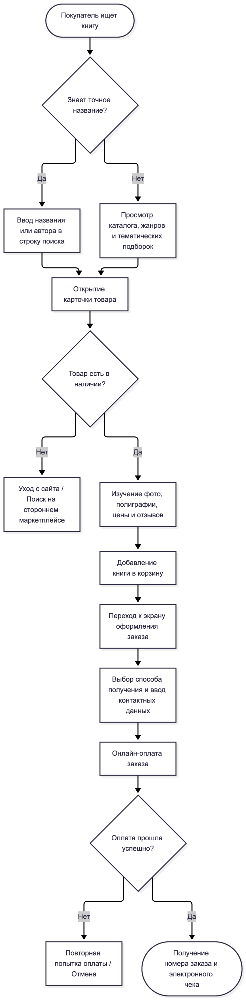
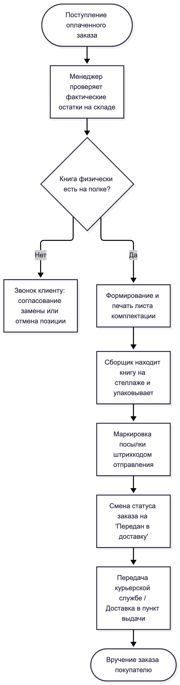

# Лабораторная работа №1
## Исследование пользователей и предметной области

**Дисциплина:** Проектирование человеко-машинных интерфейсов  
**Тема проекта:** Книжный онлайн-магазин «Litera» (каталог и управление заказами)  
**Авторы (группа 12):**  
- Зайдаль Кирилл Андреевич  
- Савицкая Анна-Мария Алексеевна  
**Преподаватель:** Давидовская М. И.  

---

## 1. Название и цели лабораторной работы

**Название работы:** Исследование пользователей и предметной области книжного онлайн-магазина «Litera».

**Цели работы:**
1. Закрепить теоретические знания по методологии человеко-центрированного проектирования интерфейсов (User-Centered Design).
2. Провести предпроектное исследование предметной области: сравнительный анализ конкурентов и анкетирование потенциальных пользователей.
3. Сформировать профили пользователей, профили среды и профили задач.
4. Выполнить синтез ключевых персонажей (архетипов) целевой аудитории и разработать контекстные сценарии взаимодействия.
5. Спроектировать ментальную объектную модель системы, матрицу ролей, стратегию дизайна и схемы сквозных бизнес-процессов As-Is.

---

## 2. Постановка задачи для проектирования

Проектируемый программный продукт — кроссплатформенный книжный онлайн-магазин **«Litera»**, включающий адаптивное веб-приложение и мобильное приложение для платформ Android и iOS.

### Социальная задача и назначение
Предоставление читателям удобного, быстрого и прозрачного инструмента поиска, выбора и приобретения как традиционных бумажных, так и электронных изданий. Система призвана решить проблемы непрозрачности информации о полиграфическом качестве изданий, перегруженности интерфейсов спамом и всплывающими окнами, а также сложности поиска редких книг и предзаказов новинок.

### Основные функциональные требования:
* Многокритериальный поиск и каталогизация по автору, жанрам, издательствам, книжным сериям и переводчикам.
* Карточка издания с полноразмерными фото разворотов, полиграфическими характеристиками и ознакомительным фрагментом текста.
* Механизм оформления предварительного заказа (предзаказ) на тиражи в печати.
* Списки отложенного чтения («Избранное», уведомления о снижении цены).
* Корзина с автосохранением сессии при сбоях сети.
* Личный кабинет с историей заказов и трекингом доставки.
* Панель менеджера и администратора для учета складских остатков и смены статусов заказов.

### Требования к мобильному форм-фактору (инфраструктура смартфона):
* **Экраны:** адаптация под дисплеи смартфонов 5.5–6.7 дюймов (разрешения от 390x844 до 430x932).
* **Эргономика («Thumb Zone»):** размещение критических элементов навигации (поиск, корзина, избранное, профиль) в нижней панели (Bottom Navigation Bar) в зоне естественной досягаемости большого пальца руки.
* **Сенсорное взаимодействие:** поддержка горизонтальных свайпов для перелистывания превью-страниц, свайпов для удаления позиции из корзины, увеличение иллюстраций жестом pinch-to-zoom.
* **Устойчивость к прерываниям:** сохранение локального состояния корзины и введенных текстовых полей при входящих вызовах, переключениях приложений и временном обрыве связи (Local Storage / Cache).

---

## 3. Анализ конкурентов

Для анализа выбраны ключевые прямые и косвенные конкуренты книжного ритейла на региональном и глобальном рынках. Анализ проведен на базе метрик веб-аналитики (SimilarWeb) и экспертной оценки интерфейсов.

| Параметр сравнения | OZ.by (Беларусь) | Читай-город (СНГ) | Литрес (Цифровые книги) | Ozon / WB (Книжный раздел) |
| :--- | :--- | :--- | :--- | :--- |
| **Тип конкурента** | Прямой, локальный лидер | Прямой, глобальный/сетевой | Косвенный (цифровой контент) | Косвенный / кросс-ритейл маркетплейс |
| **Ежемесячный трафик** | ~3.8 – 4.2 млн визитов | ~14 – 16 млн визитов | ~22 – 25 млн визитов | >300 млн визитов (суммарно) |
| **Глубина / Время на сайте** | 5.8 страниц / 4:40 мин | 6.2 страниц / 5:15 мин | 4.9 страниц / 4:10 мин | 8.5 страниц / 7:20 мин |
| **Региональная популярность** | Беларусь (92%), Россия (4%) | Россия (84%), Беларусь (6%), Казахстан (4%) | Россия (78%), Беларусь (7%), СНГ (15%) | Россия, Беларусь, СНГ |
| **Каналы трафика** | Direct (48%), Search (41%), Referral (6%), Social (5%) | Search (52%), Direct (36%), Social (7%), Ads (5%) | Search (58%), Direct (27%), Ads (10%), Social (5%) | Direct (60%), Organic (28%), Apps (высокая доля) |
| **Ценовая политика** | Средняя/выше средней, накопительная скидка | Средняя, бонусы за покупки, частые промокоды | Модели подписки, поштучная покупка файлов | Демпинг за счет объемов складов, дешевая доставка |
| **Преимущества UI/UX** | Развитая сеть самовывоза, понятный локальный чекаут | Удобные тематические подборки, качественные иллюстрации | Мгновенный доступ, встроенная читалка | Быстрое оформление в 1 клик, сохранение карт |
| **Недостатки UI/UX** | Перегруженность карточек некнижными товарами | Медленная загрузка тяжелых страниц мобильной версии | Отсутствие бумажных изданий, запутанная подписка | Хаос в отзывах, риск брака упаковки, нет превью страниц |

---

## 4. Опросник и результаты опроса

Опрос потенциальных пользователей проводился онлайн с помощью Google Forms. Выборка составила **17 респондентов** (студенты и специалисты IT/интеллектуальной сферы).

**Ссылка на форму опроса:** [Google Forms: Исследование опыта покупки книг Litera](https://forms.gle/93ei1SVsj65ajknK9)

### 4.1. Сводные количественные результаты

#### Социально-демографический профиль:
* **Возраст:** 18–24 года — **88.2%** (15 чел.); младше 18 лет — **5.9%** (1 чел.); 25–34 года — **5.9%** (1 чел.).
* **Род деятельности:** Студент/учащийся — **82.4%** (14 чел.); IT/технологии — **11.8%** (2 чел.); Офис/интеллектуальный труд — **5.9%** (1 чел.).
* **Уровень цифровой грамотности:** Уверенный пользователь — **76.5%** (13 чел.); Продвинутый — **11.8%** (2 чел.); Базовый — **11.8%** (2 чел.).

#### Профиль среды и контекст:
* **Приоритетное устройство:** Преимущественно смартфон — **64.7%** (11 чел.); Одинаково смартфон и ПК — **29.4%** (5 чел.); Преимущественно ПК/ноутбук — **5.9%** (1 чел.).
* **Обстановка оформления заказа:** Дома в спокойной обстановке за столом/на диване — **88.2%** (15 чел.); Перед сном в кровати (слабое освещение) — **5.9%** (1 чел.); На работе/учебе в перерывах — **5.9%** (1 чел.).
* **Чувствительность к прерываниям сессии:** Редко сталкиваются — **58.8%** (10 чел.); Часто (критично сохранение корзины при сбоях) — **29.4%** (5 чел.); Иногда — **11.8%** (2 чел.).

#### Потребительские предпочтения:
* **Формат изданий (множественный выбор):** Бумажные книги — **82.4%** (14 чел.); Электронные книги — **35.3%** (6 чел.); В подарок — **23.5%** (4 чел.); Аудиокниги — **17.6%** (3 чел.).
* **Методы поиска книг:** Ввод точного названия/автора в строку поиска — **100.0%** (17 чел.); Списки бестселлеров и рекомендаций — **23.5%** (4 чел.); Поиск по издательству или серии — **17.6%** (3 чел.); Тематические подборки — **17.6%** (3 чел.); Каталог по жанрам — **17.6%** (3 чел.).
* **Критически важная информация в карточке товара:**
  1. Цена, скидки и акции — **76.5%** (13 чел.)
  2. Отзывы и оценки читателей — **64.7%** (11 чел.)
  3. Качественные фото обложки, разворотов и бумаги — **52.9%** (9 чел.)
  4. Бесплатный ознакомительный фрагмент текста — **29.4%** (5 чел.)
  5. Сроки и стоимость доставки — **23.5%** (4 чел.)
  6. Технические параметры (переплет, переводчик, тираж, страницы) — **23.5%** (4 чел.)
* **Опыт предзаказов:** Покупают только из наличия — **82.4%** (14 чел.); Не знали о возможности предзаказа — **17.6%** (3 чел.). Ни один респондент не использует предзаказ регулярно.
* **Использование вишлистов («Избранное»):** Регулярно сохраняют в избранное до скидок/стипендии — **41.2%** (7 чел.); Сразу добавляют в корзину — **41.2%** (7 чел.); Ведут списки во внешних блокнотах — **17.6%** (3 чел.).
* **Сервисы, использованные за год:** Маркетплейсы WB/Ozon — **94.1%** (16 чел.); OZ.by — **64.7%** (11 чел.); Литрес — **23.5%** (4 чел.); Буквоед — **11.8%** (2 чел.); Яндекс Книги — **11.8%** (2 чел.); Читай-город — **5.9%** (1 чел.); Лабиринт — **5.9%** (1 чел.).

### 4.2. Анализ болей пользователей (Pain Points)
1. **Навязчивые всплывающие окна и спам (47.1%):** агрессивные баннеры перекрывают экран мобильного устройства.
2. **Неудобный мобильный UI (35.3%):** мелкий шрифт, трудно попасть по кнопкам, интерфейс не оптимизирован под одну руку.
3. **Отсутствие ознакомительного фрагмента (35.3%):** невозможно оценить слог книги, шрифт и стиль оформления перед заказом.
4. **Неактуальный статус наличия на складе (35.3%):** товар числится в наличии, но отменяется после оплаты.
5. **Высокая стоимость и долгие сроки доставки (35.3%):** скрытые платежи на этапе чекаута.
6. **Недостаток сведений об издании (29.4%):** отсутствие информации о типе обложки (твердая/мягкая), плотности бумаги и конкретном переводчике.
7. **Перегруженный чекаут (29.4%):** требование избыточных персональных данных при оформлении единичной покупки.

---

## 5. Профили пользователей

На основе опроса выделены два основных профиля конечных пользователей системы:

### Профиль 1: Студент-читатель (Основной покупатель)
* **Социальные характеристики:** 18–24 года, неполное высшее образование (студент ФПМИ/ИТ/гуманитарных направлений), не состоит в браке, доход — стипендия и подработка. Компьютером и смартфоном пользуется единолично.
* **Навыки и умения:** Стаж работы с ПК более 10 лет, опытный пользователь мобильных приложений и интернет-магазинов. Внутреннее устройство веб-технологий понимает на уверенном уровне.
* **Рабочая среда:** Смартфон (iOS/Android) с экраном 6.1"–6.7", ноутбук 13"–15". Wi-Fi подключение дома, мобильный LTE/3G в дороге.
* **Мотивационно-целевая среда:** Покупка учебной, технической и современной художественной литературы по доступной цене. Высокая чувствительность к акциям и скидкам, мотивация к освоению системы высокая при условии чистого и быстрого UI.

### Профиль 2: Менеджер по логистике и обработке заказов (Внутренний персонал)
* **Социальные характеристики:** 25–40 лет, высшее или среднее специальное образование, штатный сотрудник интернет-магазина.
* **Навыки и умения:** Уверенный пользователь офисного ПО, CRM-систем и складских баз данных. Навыки быстрой работы с клавиатурными сокращениями.
* **Рабочая среда:** Стационарный офисный ПК, два монитора FullHD 24", проводной стабильный интернет 100 Мбит/с, гарнитура для звонков.
* **Мотивационно-целевая среда:** Быстрая верификация входящих заказов, оперативное изменение складских статусов, минимизация ошибок при формировании накладных.

---

## 6. Профили задач

| Профиль пользователя | Наименование задачи | Частота | Важность | Очередность | Зависимости |
| :--- | :--- | :--- | :--- | :--- | :--- |
| **Покупатель** | Поиск книги по названию/автору | Высокая (ежедневно) | Критическая | 1 | Доступность индекса поиска |
| **Покупатель** | Просмотр карточки (фото, ознакомление с фрагментом) | Высокая | Высокая | 2 | Выдача результатов поиска |
| **Покупатель** | Добавление в корзину / Избранное | Средняя | Высокая | 3 | Открытие карточки товара |
| **Покупатель** | Оформление и онлайн-оплата заказа | Средняя (1–2 раза в месяц) | Критическая | 4 | Сформированная корзина |
| **Покупатель** | Оформление предзаказа новинки | Низкая | Средняя | 5 | Каталог анонсов |
| **Менеджер** | Просмотр списка новых заказов | Постоянно в течение дня | Критическая | 1 | Авторизация персонала |
| **Менеджер** | Смена статуса заказа (Сборка / Отправлен) | Высокая | Высокая | 2 | Наличие заказа в очереди |
| **Администратор** | Добавление новой книги / редактирование остатков | Периодически | Высокая | 1 | Доступ к админ-панели |

---

## 7. Профиль среды

Таблица характеристик контекста использования продукта и их прямого влияния на интерфейс:

| Характеристика среды | Признак | Влияние на проектируемый интерфейс |
| :--- | :--- | :--- |
| **Место использования** | Жилое помещение (88.2%), общественный транспорт, улица в движении | Необходимость адаптивного мобильного лейаута; крупные области кликабельности (touch targets ≥ 48px); отсутствие мелких всплывающих элементов. |
| **Освещенность** | Яркий дневной свет / приглушенный комнатный / темнота перед сном | Высокая контрастность текстовых блоков (соответствие WCAG AA); поддержка системной темной темы (Dark Mode). |
| **Аппаратное обеспечение** | Сенсорные дисплеи смартфонов (64.7%), ноутбуки с тачпадом | Поддержка нативных свайпов, масштабирования разворотов; оптимизация размера загружаемых картинок обложек. |
| **Программное обеспечение** | Мобильные браузеры (Safari, Chrome), Android Webview, Desktop Web | Кроссбраузерная адаптивность, корректный перенос верстки, прогрессивное кэширование (PWA / LocalStorage). |
| **Прерывания и помехи** | Входящие звонки, переключение приложений, нестабильный мобильный интернет | **Критическое требование:** сохранение наполнения корзины и черновиков полей чекаута в локальном хранилище устройства; уведомление об отсутствии сети без потери введенных данных. |

---

## 8. Профили групп

Синтез профилей среды, задач и социально-демографических параметров позволил выделить три ключевые группы пользователей:

```
+-----------------------------------------------------------------------------------+
| Группа №1: «Мобильные студенты-покупатели» (Доминирующая группа, ~85% аудитории) |
| - Возраст: 18-24 года, студенты вузов (ФПМИ и смежные специальности).            |
| - Устройство: смартфоны (iOS/Android), активное использование дома и в пути.      |
| - Поведение: прямой целенаправленный поиск конкретных авторов/книг, высокая       |
|   чувствительность к скидкам, сохранение в вишлист до снижения цены.             |
| - Требование: быстрый мобильный интерфейс, отсутствие навязчивой рекламы.        |
+-----------------------------------------------------------------------------------+

+-----------------------------------------------------------------------------------+
| Группа №2: «Вдумчивые коллекционеры и читатели» (~15% аудитории)                 |
| - Возраст: 25-35+ лет, специалисты IT и интеллектуального труда.                 |
| - Устройство: ноутбуки и стационарные ПК, спокойная домашняя среда.              |
| - Поведение: тщательное изучение параметров издания (бумага, переводчик,         |
|   ознакомительный фрагмент), оформление крупных заказов с доставкой курьером.    |
| - Требование: полнота технических характеристик, высокое разрешение фотокниг.    |
+-----------------------------------------------------------------------------------+

+-----------------------------------------------------------------------------------+
| Группа №3: «Операторы склада и менеджеры заказов» (Корпоративные пользователи)   |
| - Возраст: 22-45 лет, сотрудники бэк-офиса книжного магазина.                    |
| - Устройство: настольные ПК, два монитора, мышь + клавиатура, быстрый интернет.  |
| - Поведение: массовая пакетная обработка накладных, мониторинг остатков.         |
| - Требование: плотный информационный интерфейс (data-dense), клавиатурные хоткеи.|
+-----------------------------------------------------------------------------------+
```

---

## 9. Персонажи (User Personas)

### Персонаж 1: Алексей (Ключевой персонаж — Студент-читатель)


* **Возраст:** 20 лет.
* **Социальное положение:** Студент 4 курса факультета прикладной математики, проживает в общежитии/на съемной квартире, подрабатывает стажером-разработчиком.
* **Окружение:** Смартфон iPhone 13, ноутбук MacBook Air. Постоянно пользуется мессенджерами и мобильным банкингом.
* **Бизнес-цели:** Быстро находить нужную профессиональную и художественную литературу с минимальными затратами времени и денег.
* **Личные цели:** Собрать собственную библиотеку классической фантастики; успевать читать в перерывах между учебой.
* **Боли и фрустрации:** Раздражают спам-баннеры и всплывающие окна акций на пол-экрана; бесит, когда заказываешь книгу, а через 2 дня перезванивают и говорят, что ее нет на складе.
* **Ожидания:** Простой поиск по автору, наглядная цена со скидкой, сохранение корзины при внезапном закрытии браузера.

### Персонаж 2: Марина (Ключевой персонаж — Оператор обработки заказов)


* **Возраст:** 29 лет.
* **Социальное положение:** Старший менеджер интернет-магазина «Litera», стаж работы в книжной торговле 4 года.
* **Окружение:** Рабочий кабинет при распределительном складе, стационарный ПК (Windows 11, Chrome), гарнитура, терминал сбора данных.
* **Бизнес-цели:** Обрабатывать не менее 120 заказов за смену без задержек и ошибок комплектации.
* **Личные цели:** Избежать претензий и жалоб клиентов из-за пересортицы или утери данных; вовремя закрывать рабочую смену.
* **Боли и фрустрации:** Медленно обновляющиеся статусы склада; неразбериха при оформлении предзаказов клиентами.
* **Ожидания:** Четкая таблица входящих заказов с возможностью массовой смены статусов и фильтрацией по службе доставки.

### Персонаж 3: Валерий Павлович (Дополнительный персонаж — Коллекционер-библиофил)


* **Возраст:** 48 лет.
* **Социальное положение:** Преподаватель университета, исследователь.
* **Окружение:** Домашний кабинет, ноутбук с внешним монитором 27".
* **Цели:** Поиск редких академических изданий, монографий и качественных переизданий.
* **Боли:** В интернет-магазинах часто не указан переводчик, нет информации о переплете (твердый/интегральный) и плотности бумаги; нельзя полистать первые страницы книги.
* **Ожидания:** Наличие бесплатного ознакомительного фрагмента (PDF-превью) и детализированных характеристик книги.

### Персонаж 4: Спам-бот / Недобросовестный скрапер (Анти-персонаж)
* **Описание:** Автоматизированный скрипт парсинга цен и выкачивания каталога.
* **Цели:** Создание паразитной нагрузки на сервер базы данных, массовое бронирование корзин без оплаты.
* **Противодействие в UX/UI:** Внедрение невидимой капчи (Cloudflare Turnstile), блокировка массового создания неоплаченных заказов-дубликатов.

---

## 10. Контекстные сценарии каждого персонажа

### Сценарий Алексея (Покупка книги со смартфона)
* **Контекст:** Вечер дома на диване после пар. Алексей вспомнил рекомендацию книги по системной аналитике.
* **Основной путь (Happy Path):**
  1. Алексей открывает мобильный сайт «Litera» со смартфона.
  2. Вводит в поисковую строку автора: «Карл Вигерс».
  3. В результатах поиска видит книгу «Разработка требований к ПО», нажимает на карточку.
  4. Проверяет наличие зеленого бейджа «В наличии на складе» и актуальную цену со скидкой.
  5. Пролистывает фотографии разворотов и нажимает кнопку «В корзину».
  6. Переходит в корзину, выбирает пункт самовывоза рядом с домом, способ оплаты «Картой онлайн» и подтверждает заказ.
  7. Получает лаконичный экран с номером заказа и SMS-уведомление.
* **Исключение / Альтернатива:** В момент перехода к оплате входящий звонок прерывает сессию. После завершения звонка Алексей возвращается в браузер — корзина полностью сохранена, оформление продолжается с шага оплаты.

### Сценарий Марины (Обработка партии заказов на складе)
* **Контекст:** 9:00 утра, начало рабочей смены менеджера на складе.
* **Основной путь:**
  1. Марина авторизуется в служебной панели управления заказами под ролью «Менеджер».
  2. Фильтрует список по критериям: «Статус = Оплачен», «Тип доставки = Курьер по Минску».
  3. Выбирает первые 20 заказов чекбоксами и нажимает кнопку «Сформировать лист комплектации».
  4. Система генерирует сводную накладную для сборщиков и переводит заказы в статус «На сборке».

### Типичный день персонажа (Алексей)
> Алексей просыпается в 7:30, проверяет мессенджеры и ленту новостей на смартфоне. Дорога на учебу в университет на общественном транспорте занимает 40 минут — идеальное время для чтения электронной книги. На лекции преподаватель советует редкую книгу по проектированию архитектуры систем. Алексей сразу открывает браузер на смартфоне, чтобы найти издание. Встретив в другом магазине долгую загрузку и навязчивый баннер на пол-экрана, он закрывает вкладку. Вечером, уже в спокойной домашней обстановке, он открывает «Litera», находит книгу через быстрый поисковый инпут за 5 секунд, видит четкую пометку о наличии, просматривает первые 5 страниц в ознакомительном режиме и оформляет доставку за три клика.

---

## 11. Анализ задач и ролей пользователей

Матрица соответствия функциональных задач ролям пользователей в системе «Litera»:

| Функциональная задача системы | Гость | Покупатель (Читатель) | Менеджер заказов | Администратор каталога |
| :--- | :---: | :---: | :---: | :---: |
| Просмотр каталога и поиск книг | + | + | + | + |
| Просмотр ознакомительного фрагмента текста | + | + | - | + |
| Добавление товара в корзину | + | + | - | - |
| Регистрация и авторизация в личном кабинете | + | + | - | - |
| Добавление книги в список «Избранное» | - | + | - | - |
| Оформление и оплата заказа | - | + | - | - |
| Оформление предзаказа новинки | - | + | - | - |
| Просмотр статуса и трекинга доставки | - | + | + | + |
| Оставление отзыва и оценки книге | - | + | - | + (модерация) |
| Просмотр очереди входящих заказов | - | - | + | + |
| Изменение статуса заказа (Сборка / Доставка) | - | - | + | + |
| Формирование накладных на отгрузку | - | - | + | + |
| Добавление / редактирование книги в базе | - | - | - | + |
| Управление остатками на складе | - | - | + | + |
| Управление учетными записями пользователей | - | - | - | + |

---

## 12. Объектная модель системы

### 12.1. Реестр объектов предметной области

| Объект | Тип объекта | Мощность | Представления | Допустимые действия | Основные атрибуты (свойства) |
| :--- | :--- | :--- | :--- | :--- | :--- |
| **Книга (Издание)** | Данные | Десятки тысяч | Плитка в каталоге, детальная карточка, строка накладной | Просмотреть, добавить в корзину, добавить в вишлист, редактировать | `id`, `title`, `ISBN`, `price`, `discount_price`, `stock_count`, `binding_type`, `pages`, `cover_url`, `year`, `description` |
| **Автор** | Данные | Тысячи | Карточка автора, ссылка в каталоге | Просмотреть библиографию, фильтровать книги | `id`, `full_name`, `bio`, `photo_url`, `books_count` |
| **Издательство** | Данные | Сотни | Страница издательства, фильтр | Просмотреть каталог издательства | `id`, `name`, `country`, `description`, `series_list` |
| **Ознакомительный фрагмент** | Данные | Тысячи | Встроенный модальный ридер (PDF/текст) | Листать, масштабировать, закрыть | `id`, `book_id`, `file_url`, `pages_preview_count` |
| **Корзина** | Функциональный | Тысячи (пользовательские) | Выпадающая панель, отдельная страница чекаута | Добавить, изменить кол-во, удалить, применить промокод, очистить | `id`, `user_id`/`session_id`, `items_list`, `total_price`, `promocode`, `updated_at` |
| **Заказ** | Данные | Десятки тысяч | Карточка заказа в ЛК, строка в таблице менеджера | Создать, оплатить, сменить статус, отменить | `id`, `order_number`, `user_id`, `status` (Новый/Оплачен/В сборке/Отправлен), `delivery_address`, `total_sum`, `created_at` |
| **Список «Избранное»** | Данные / Функц. | Десятки тысяч | Сетка сохраненных карточек | Добавить, удалить, переместить все в корзину | `user_id`, `book_ids_list`, `created_at` |
| **Поисковый фильтр** | Функциональный | Единичный | Сайдбар на десктопе, шторка (BottomSheet) на мобилке | Применить, сбросить, сортировать | `genre_ids`, `price_min`, `price_max`, `in_stock_only`, `binding`, `publisher_ids`, `sort_order` |

### 12.2. Соответствие объектов персонажам

| Объект системы | Алексей (Студент) | Марина (Менеджер) | Валерий Павлович (Коллекционер) |
| :--- | :---: | :---: | :---: |
| Книга (карточка издания) | Постоянно | Для сверки данных | Постоянно |
| Ознакомительный фрагмент | Периодически | Не использует | Критически важно |
| Поисковый фильтр | По названию / автору | По артикулу / ISBN | По издательству / серии |
| Корзина | Регулярно | Не использует | Регулярно |
| Список «Избранное» | Постоянно (ждёт скидок) | Не использует | Редко |
| Заказ (смена статуса / накладная) | Просмотр статуса в ЛК | Основной рабочий инструмент | Просмотр статуса в ЛК |
| Складские остатки | Индикатор наличия | Управление и аудит | Индикатор наличия |

---

## 13. Стратегия дизайна

1. **Заинтересованные стороны (Стейкхолдеры):**
   * Розничные покупатели (студенты, специалисты, книголюбы).
   * Персонал интернет-магазина (менеджеры логистики, сотрудники склада).
   * Книжные издательства и авторы (партнеры по предзаказам и поставкам).
2. **Видение продукта:**
   * Создание быстрого, лаконичного и устойчивого к внешним прерываниям сервиса, свободного от визуального спама, с исчерпывающей информацией о физическом состоянии изданий и возможностью бесплатного ознакомления с текстом.
3. **Конфликты и противоречия:**
   * *Бизнес vs Пользователь:* бизнес стремится показать промо-акции и партнерские баннеры, тогда как 47.1% опрошенных категорически против всплывающих окон. Решение: отказ от модальных поп-апов в пользу встроенных ненавязчивых баннеров в ленте каталога.
   * *Полнота данных vs Простота мобильного экрана:* коллекционерам нужны подробные полиграфические данные, а студентам — чистый экран. Решение: двухуровневая карточка книги (главные параметры видны сразу, полная спецификация скрыта под спойлер «Все характеристики»).
4. **Задачи бизнеса и маркетинга:**
   * Рост конверсии из поиска в покупку на мобильных устройствах.
   * Популяризация сервиса предварительного заказа (ликвидация 82% барьера непонимания предзаказа).
5. **Измеримые критерии успешности (KPI):**
   * Время прохождения чекаута от корзины до оплаты: ≤ 45 секунд.
   * Уровень брошенных корзин из-за сбоев соединения: < 5%.
   * Оценка удобства интерфейса по опросу CSAT: не менее 4.6 из 5.
6. **Технические ограничения и стек:**
   * Веб: React / Next.js, адаптивная сеточная верстка CSS Grid/Flexbox.
   * Сервер: Python / Django REST Framework / PostgreSQL.
   * Мобильное приложение: React Native / Flutter (поддержка iOS 15+ и Android 10+).
7. **Бюджет и примерный график реализации:**
   * Срок реализации учебного прототипа: 1 семестр (8 лабораторных спринтов).
   * Трудозатраты: команда из 2 инженеров.

---

## 14. Диаграммы бизнес-процессов As-Is

Диаграммы отражают реальный процесс покупки и складской обработки в книжном ритейле «как есть сейчас».

### 14.1. Процесс оформления покупки покупателем (As-Is)



### 14.2. Процесс складской обработки и выдачи заказа (As-Is)



---

## 15. Общие выводы по лабораторной работе

1. В рамках лабораторной работы проведен комплексный предварительный анализ предметной области книжного онлайн-магазина «Litera» в соответствии с принципами человеко-ориентированного проектирования (UCD).
2. Проведенный опрос (17 респондентов) показал, что 64.7% аудитории заказывают книги преимущественно со смартфона, при этом 100% пользователей используют прямой поиск по названию/автору. Выявлены ключевые раздражающие факторы существующих сервисов: рекламный спам (47.1%), неудобный мобильный интерфейс (35.3%) и отсутствие ознакомительных фрагментов книг (35.3%).
3. Сформированы профили пользователей, среды и задач, а также синтезированы 4 персонажа, отражающие потребности основных сегментов читателей и административного персонала интернет-магазина.
4. Разработанная объектная модель и матрица задач и ролей закладывают основу для проектирования компонентной структуры и API системы на последующих этапах лабораторных работ.
