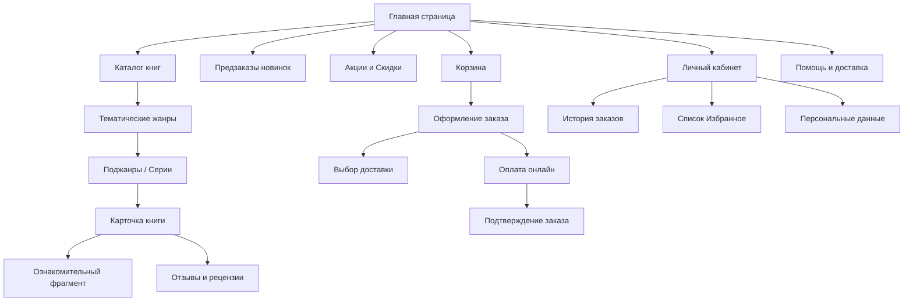
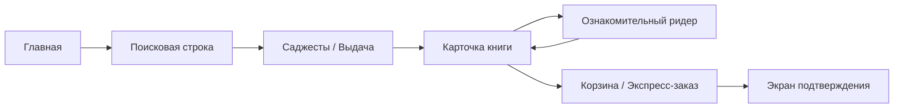
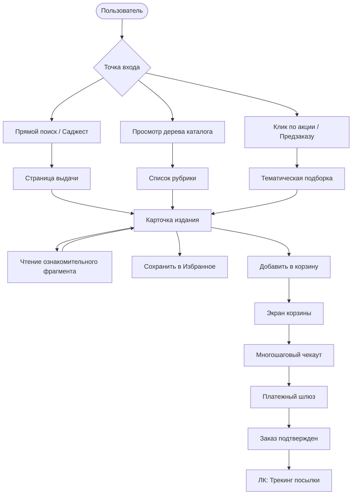
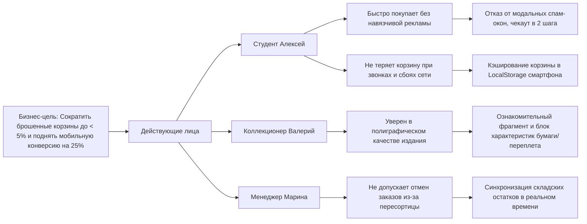

# Лабораторная работа №2

## Проектирование информационной архитектуры и взаимодействия с пользователем

**Дисциплина:** Проектирование человеко-машинных интерфейсов  
**Тема проекта:** Книжный онлайн-магазин «Litera» (каталог и управление заказами)  
**Авторы (группа 12):**  
- Зайдаль Кирилл Андреевич  
- Савицкая Анна-Мария Алексеевна  
**Преподаватель:** Давидовская М. И.  

---

## 1. Дополнение и уточнение разделов лабораторной работы №1

В ходе перехода от предварительного анализа к детальному концептуальному проектированию информационной архитектуры спецификация проекта была уточнена с учетом результатов анкетирования (17 респондентов) и специфики двух платформ (веб и мобайл):

1. **Постановка задачи:** В мобильном приложении акцент смещен на сессионную покупку в один клик и быстрый доступ к сохраненной корзине (устойчивость к обрывам связи), а в веб-версии — на расширенный каталог, сравнение изданий и глубокую фильтрацию по полиграфическим характеристикам.
2. **Стратегия дизайна:** Сформирован строгий отказ от всплывающих рекламных поп-апов и оверлеев в пользу встроенных блоков рекомендаций в карточке и ленте каталога. Введен двухуровневый просмотр карточки: быстрые параметры для мобильных экранов и разворачиваемая спецификация для букинистов и коллекционеров.
3. **Уточненная объектная модель:** Добавлен функциональный объект `Ознакомительный фрагмент` (модальный ридер превью) и `Сессия чекаута` (кэширование состояния оформления).

---

## 2. Концептуальное проектирование и тип интерфейса

Согласно методологии Алана Купера и классификации типов интерфейсов настольных и мобильных систем:

* **Веб-приложение «Litera» (Десктоп):**
  * *Для покупателя:* **Временный тип интерфейса** с элементами монопольного во время целенаправленного оформления заказа. Пользователь приходит для решения конкретной функциональной задачи (найти книгу, прочитать ознакомительный фрагмент, оформить предзаказ) и покидает сервис.
  * *Для менеджера склада:* **Монопольный тип интерфейса**. Панель управления заказами является основным рабочим инструментом сотрудника в течение 8-часовой рабочей смены, требует высокой плотности данных (data-dense UI), табличных реестров и поддержки клавиатурных сокращений.
* **Мобильное приложение «Litera» (iOS/Android):**
  * **Временный тип интерфейса** с высокой частотой прерываний (звонки, мессенджеры, пересадки в транспорте). Требует мгновенной загрузки первого экрана, сохранения фокуса ввода и кэширования локальной корзины.

---

## 3. Информационная архитектура (п. 6 методических указаний)

### 3.1. Система организации контента

#### Аудит и инвентаризация контента

| Единица контента | Тип | Формат | Объем | Владелец | Статус |
| :--- | :--- | :--- | :--- | :--- | :--- |
| Каталог изданий | Структурированные данные | Карточки, сетка, списки | > 50 000 позиций | Контент-менеджер | Динамический |
| Карточка книги | Информационный блок | Текст, WebP-изображения, PDF | 1 страница на ISBN | Издательство / Контентщик | Динамический |
| Ознакомительный фрагмент | Медиа-контент | Интерактивный PDF / HTML-ридер | Первые 15–30 страниц | Издательство / Litera | Статический |
| Отзывы и оценки | Пользовательский контент (UGC) | Текст, рейтинг 1–5 звезд | Десятки на книгу | Покупатели | Модерируемый |
| Корзина и оформление | Функциональный поток | Интерактивная форма, поля ввода | 1 сессия на пользователя | Покупатель / Система | Временный (кэш) |
| Личный кабинет / Заказы | Персональные данные | Таблицы, бейджи статусов, трекинг | 1 профиль на аккаунт | Покупатель | Защищенный |
| Складской реестр | Управленческий контент | Таблицы, фильтры, накладные | Потоковые данные | Менеджер склада | Служебный |

#### Схема организации и принцип группировки

* **Схема организации:** **Фасетная (многомерная)** в сочетании с **иерархической древовидной** структурой каталога. Фасетная классификация позволяет фильтровать книги одновременно по независимым измерениям: жанр, автор, издательство, тип обложки (твердая/мягкая), диапазон цен и статус наличия.
* **Принцип группировки:** Гибридный — по **тематике** (рубрикатор жанров), по **задачам пользователя** (новинки, предзаказы, бестселлеры, акции) и по **формату** (бумажные, электронные, подарочные).

#### Карта сайта (Sitemap — глубина ≥ 3 уровней)



### 3.2. Система именования

#### Словарь терминов интерфейса (Glossary)

| Термин | Определение | Область использования в интерфейсе |
| :--- | :--- | :--- |
| **Каталог** | Полный структурированный перечень доступных изданий с фасетными фильтрами | Главное меню, кнопка вызова рубрикатора |
| **Предзаказ** | Оформление заявки на тираж, находящийся на этапе печати или транспортировки | Карточка книги, баннеры анонсов, фильтр каталога |
| **Ознакомительный фрагмент** | Бесплатный просмотр начальных страниц книги в модальном окне | Кнопка в карточке товара («Читать фрагмент») |
| **Избранное (Вишлист)** | Персональный список отложенных изданий с отслеживанием скидок | Иконка сердца в шапке / навигаторе, карточка товара |
| **Корзина** | Временный контейнер выбранных для покупки товаров с калькуляцией скидок | Кнопка в шапке, плавающая плашка чекаута |
| **Самовывоз** | Доставка заказа в партнерский пункт выдачи или фирменный магазин | Форма выбора способа доставки при чекауте |
| **ISBN** | Международный стандартный книжный номер (уникальный идентификатор) | Блок полиграфических характеристик карточки книги |

#### Структура человекопонятных URL (ЧПУ)

Спроектирована прозрачная иерархическая структура веб-адресов:
* **Каталог жанра:** `litera.by/catalog/fiction/`
* **Поджанр:** `litera.by/catalog/fiction/sci-fi/`
* **Карточка конкретной книги:** `litera.by/book/978-5-17-135848-dune`
* **Страница автора:** `litera.by/author/frank-herbert/`
* **Полнотекстовый поиск:** `litera.by/search?q=архитектура+систем&sort=popular`
* **Корзина и чекаут:** `litera.by/checkout/step-1/`

#### Система меток и пиктограмм (Icons System)
* **Magnifying Glass (Лупа)** — строка и кнопка инициации поиска.
* **Bookmark / Heart (Сердце / Закладка)** — добавление книги в «Избранное».
* **Shopping Bag (Сумка / Корзина)** — просмотр корзины с бейджем количества товаров.
* **Book Open (Раскрытая книга)** — вызов бесплатного ридера фрагмента.
* **Sliders (Ползунки)** — вызов шторки фасетных фильтров на мобильных экранах.

---

### 3.3. Система навигации

#### Уровни навигации

* **Глобальная навигация (Header / Footer / Bottom Bar):**
  * *Веб-интерфейс:* верхняя панель (Логотип, Каталог с выпадающим мега-меню, Строка умного поиска, Избранное, Корзина, Личный кабинет). Нижний колонтитул (Footer): разделы о доставке, контакты, оферта, карта сайта.
  * *Мобильное приложение:* нижняя навигационная панель (Bottom Navigation Bar) с 5 ключевыми разделами: Главная, Каталог, Поиск, Избранное, Профиль.
* **Локальная навигация:**
  * *Левый сайдбар в веб-версии:* переключение подрубрик внутри жанра, алфавитный указатель авторов.
  * *Мобильная шторка (BottomSheet):* группировка параметров фильтрации.
* **Контекстная навигация:**
  * *Внутри карточки книги:* карусели «Книги из этой же серии», «Другие произведения автора», «С этой книгой покупают».
  * *Гиперссылки на страницах:* кликабельные имена авторов, переводчиков и названия издательств.
* **Вспомогательная навигация:**
  * *Хлебные крошки (Breadcrumbs):* путь вида `Главная > Каталог > Нехудожественная литература > Компьютерные науки`.
  * Кнопка быстрой прокрутки «Наверх» при скролле более 2 экранов.
  * Пагинация и бесконечный скролл с кнопкой «Показать еще 20 книг».

---

### 3.4. Система поиска

#### Поисковый интерфейс и архитектура
* **Размещение:** Центральное фиксированное поле в десктопной шапке; закрепленная поисковая строка в мобильном приложении.
* **Автодополнение (Саджесты):** Срабатывает при вводе от 2 символов с задержкой debounce 250 мс. Показывает 3 блока: 1) Совпадения по авторам, 2) Топ-3 карточки найденных книг с миниатюрой обложки и ценой, 3) Быстрый переход в категорию жанра.
* **Обработка опечаток:** Полнотекстовый поиск на базе расстояния Левенштейна (например, автоисправление запроса «достоевский» при опечатке «дастаевский» с плашкой «Возможно, вы искали: Достоевский»).

#### Схема метаданных поиска

| Поле метаданных | Тип поиска | Вес релевантности | Пример значения |
| :--- | :--- | :--- | :--- |
| `title` | Префиксный, нечеткий (Fuzzy) | 10 (Максимальный) | Мастер и Маргарита |
| `author_name` | Точное совпадение + нечеткий | 9 | Михаил Булгаков |
| `isbn` | Строгое точное совпадение | 10 | 978-5-17-135848-8 |
| `publisher` | Полнотекстовый | 6 | Эксмо, АСТ, Альпина |
| `series` | Полнотекстовый | 5 | Эксклюзивная классика |
| `tags / genres` | Категориальный индекс | 7 | Фантастика, Антиутопия |
| `description` | Полнотекстовый морфологический | 3 | Роман о Москве 30-х годов... |

---

## 4. Навигационные модели и общая диаграмма путей (п. 7)

### 4.1. Навигационная модель ключевого персонажа (Алексей, Студент)



### 4.2. Навигационная модель менеджера склада (Марина)


### 4.3. Общая совокупная диаграмма путей системы



---

## 5. Карта влияния (Impact Map) и Карта пути клиента (CJM) (п. 8)

### 5.1. Карта влияния (Impact Map)

Карта связывает стратегическую бизнес-цель интернет-магазина с поведением действующих лиц и конкретными функциональными решениями:



### 5.2. Карта пути клиента (Customer Journey Map — CJM)

**Персонаж:** Алексей (20 лет, студент, покупает со смартфона в общежитии).  
**Цель:** Найти учебник по системному анализу, оценить подачу материала и заказать с самовывозом.

| Этап пути | 1. Поиск издания | 2. Оценка книги | 3. Чтение фрагмента | 4. Оформление заказа | 5. Получение и трекинг |
| :--- | :--- | :--- | :--- | :--- | :--- |
| **Действия пользователя** | Вводит название в поисковую строку на смартфоне | Открывает карточку, смотрит цену и отзывы | Нажимает кнопку «Читать фрагмент», листает 10 страниц | Добавляет в корзину, выбирает ПВЗ, оплачивает картой | Получает push-уведомление, забирает книгу в ПВЗ |
| **Точки контакта** | Главный экран, поисковая строка, саджесты | Карточка книги, фото обложки, бейдж скидки | Встроенный модальный ридер (Clean Reader) | Корзина, форма выбора ПВЗ на карте, оплата | SMS/Push с кодом, Личный кабинет |
| **Мысли** | «Надеюсь, найдет быстро, а не выдаст кучу мусора» | «Цена адекватная, но понятный ли там язык?» | «Шрифт удобный, примеры внятные, надо брать» | «Только бы корзина не сбросилась, если мне позвонят» | «Отлично, забрал по дороге из университета» |
| **Эмоциональный статус** | Нейтральный (сосредоточен) | Сомнение (оценка бюджета) | Позитивный (высокий интерес) | Легкое напряжение (ввод карты) | Удовлетворение и радость |
| **Болевые точки (Pain Points)** | Опечатки в фамилии автора могут дать пустую выдачу | Непонятно, мягкая или твердая обложка | PDF-файл может долго грузиться по мобильной сети | Лишние поля ввода адреса при выборе самовывоза | Задержка доставки без предупреждения |
| **Решения интерфейса** | Автоисправление опечаток и превью обложек в поиске | Четкий блок спецификации переплета и плотности бумаги | Облегченный WebP/текстовый ридер с кэшированием | Автозаполнение полей, выбор ПВЗ на интерактивной карте | Онлайн-трекер статуса заказа в 1 клик |

---

## 6. Интерактивные раскадровки и макеты низкой точности (п. 9)

### 6.1. Каркас страницы каталога с фильтрацией (Десктоп Wireframe)

```
+-----------------------------------------------------------------------------------+
| [ Litera Logo ]   [ Поиск по названию, автору, ISBN... [Q] ]   [♥ Избр] [🛒(2)] [Профиль] |
+-----------------------------------------------------------------------------------+
| Главная > Каталог > Нехудожественная литература                                    |
+----------------------+------------------------------------------------------------+
| ФИЛЬТРЫ              | Найдено 142 издания                    Сортировка: [Популярные v]  |
| -------------------- | ---------------------------------------------------------- |
| Цена, BYN:           | +------------------+  +------------------+  +------------------+  |
| [ 10 ] - [ 80 ]      | | [ Обложка книги] |  | [ Обложка книги] |  | [ Обложка книги] |  |
| -------------------- | | Название книги   |  | Название книги   |  | Название книги   |  |
| Наличие:             | | Автор И. И.      |  | Автор П. П.      |  | Автор С. С.      |  |
| [x] В наличии        | | ⭐ 4.9 (42 отз.)  |  | ⭐ 4.7 (18 отз.)  |  | ⭐ 5.0 (9 отз.)   |  |
| [ ] Предзаказ        | | 32.50 BYN [-15%] |  | 45.00 BYN        |  | 28.00 BYN        |  |
| -------------------- | | [ В корзину ]    |  | [ В корзину ]    |  | [ Предзаказ ]    |  |
| Переплет:            | +------------------+  +------------------+  +------------------+  |
| [x] Твердый          |                                                            |
| [ ] Мягкий           | +------------------+  +------------------+  +------------------+  |
| -------------------- | | [ Обложка книги] |  | [ Обложка книги] |  | [ Обложка книги] |  |
| Издательства:        | | ...              |  | ...              |  | ...              |  |
| [x] Альпина          | +------------------+  +------------------+  +------------------+  |
| [ ] Эксмо            |                                                            |
| [ ] Питер            | [ 1 ] 2 3 4 ... [ Следующая > ]                            |
+----------------------+------------------------------------------------------------+
| Футер: О доставке | Способы оплаты | Карта сайта | Контакты | 2026 (c) Litera      |
+-----------------------------------------------------------------------------------+
```

### 6.2. Каркас карточки книги с читалкой фрагмента (Мобильный Wireframe — 390px)

```
+-----------------------------------+
| [< Назад]         [♥] [↗ Поделиться] |
+-----------------------------------+
|                                   |
|        +---------------------+    |
|        |                     |    |
|        |    ФОТО ОБЛОЖКИ     |    |
|        |                     |    |
|        +---------------------+    |
|        [ 1 / 4 фото разворотов ]  |
|                                   |
|  Карл Вигерс                      |
|  Разработка требований к ПО       |
|  ⭐ 4.9 (124 отзыва)               |
|                                   |
|  54.00 BYN [ -20% Скидка ]        |
|  Бейдж: [V В наличии на складе]   |
|                                   |
|  [ 📖 Читать ознакомительный фрагмент ] |
|                                   |
|  [ 🛒 В КОРЗИНУ - 54.00 BYN ]      |
|  --------------------------------- |
|  Характеристики:                  |
|  * Переплет: Твердый              |
|  * Страниц: 736                   |
|  * Бумага: Офсетная (белая)       |
|  * Переводчик: В. Г. Птицын       |
|  [ Развернуть все характеристики v] |
|  --------------------------------- |
|  Описание:                        |
|  Классическое руководство по сбору |
|  и документированию требований... |
+-----------------------------------+
| [Главная] [Каталог] [Поиск] [Избранное] [Профиль] | (Bottom Bar)
+-----------------------------------+
```

---

## 7. Спецификация дизайн-макетов в Figma (п. 10)

Для реализации цветных прототипов в Figma определены следующие стандарты дизайн-системы:

### Сетки и базовые фреймы

* **Десктопная версия (Web):**
  * Ширина фрейма: 1440 px.
  * Сетка: 12-колоночная Bootstrap Grid (Container width: 1140 px, Columns: 12, Gutter: 24 px, Margin: auto).
* **Мобильная версия (Mobile App):**
  * Ширина фрейма: 390 x 844 px (iPhone 13/14/15) или 375 x 670 px.
  * Сетка: 8pt Grid System (базовый шаг отступов: 8px, 16px, 24px, 32px), боковые поля (Margins): 16 px.

### Цветовая палитра и типографика

* **Primary (Акцентный цвет):** `#1E40AF` (Глубокий синий — доверие, контрастность, классический книжный стиль).
* **Accent / Action (Действие, Скидки, Кнопки CTA):** `#EA580C` (Теплый терракотово-оранжевый — кнопки «В корзину», стикеры акций).
* **Background (Фон):** `#F8FAFC` (Светлый нейтральный slate) / Карточки: `#FFFFFF`.
* **Text Main:** `#0F172A` (Высококонтрастный темно-серый, WCAG AAA).
* **Шрифтовая пара:** Inter / Manrope для интерфейсных элементов и кнопок; Merriweather для заголовков литературных произведений и ридера фрагментов.

### Ссылка на проект и исходники

* **Figma Project:** [Интерактивный макет Litera UI Prototype в Figma](https://www.figma.com/design/KK4tOZ6qzUXQNjqm5JUyrd/Book-Store-Web-App--Community-?node-id=0-1&t=qtcHEFlIr0Fitx6B-1)

#### Разработанные интерфейсы (скриншоты макетов):

* **Главная страница:**
  

* **Страница каталога:**
  

* **Карточка книги:**
  

* **Корзина и оформление:**
  

* **Мобильная версия:**
  

---

## 8. Общие выводы по лабораторной работе №2

1. Спроектирована целостная информационная архитектура веб- и мобильного приложения книжного онлайн-магазина «Litera», объединяющая фасетную каталогизацию и иерархическую карту сайта глубиной в 4 уровня.
2. Разработана система именования и единый терминологический словарь (Glossary), исключающий двусмысленность при навигации пользователя.
3. Сформирована сквозная система навигации (глобальная, локальная, контекстная и хлебные крошки), адаптированная под мобильный эргономический паттерн зоны досягаемости большого пальца (Thumb Zone).
4. Разработанная поисковая модель с автодополнением и нечетким поиском по метаданным решает ключевую проблему 100% опрошенных пользователей, использующих прямой поиск по автору и названию.
5. Построены Customer Journey Map (CJM) и Impact Map, позволившие выявить критические точки оттока на этапе чекаута и заложить требования к локальному кэшированию сессии оформления заказа.
