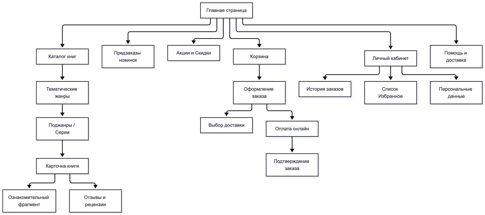
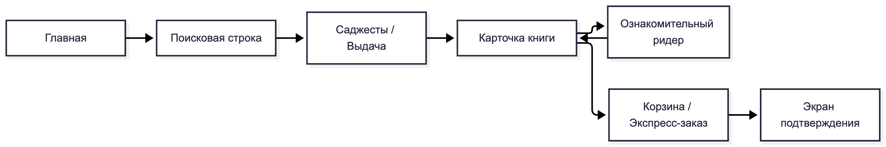
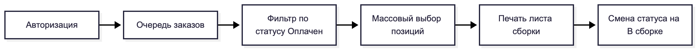
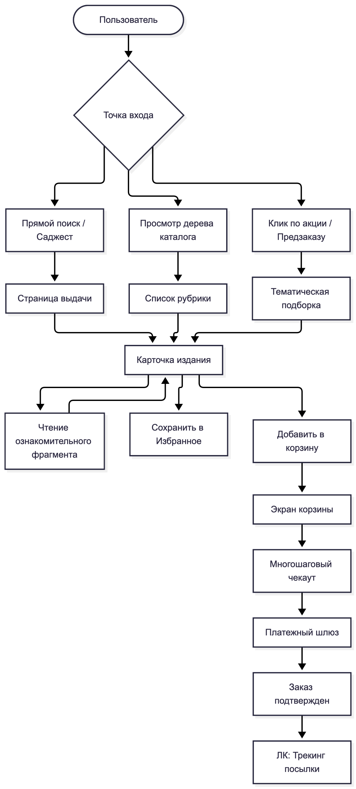
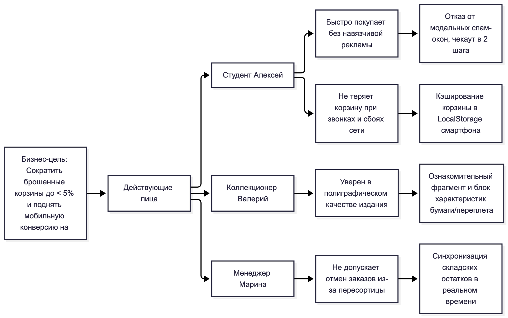
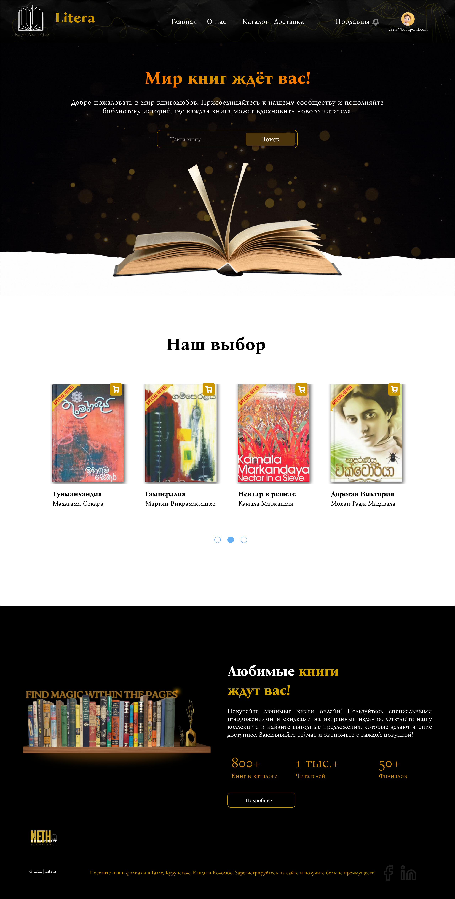
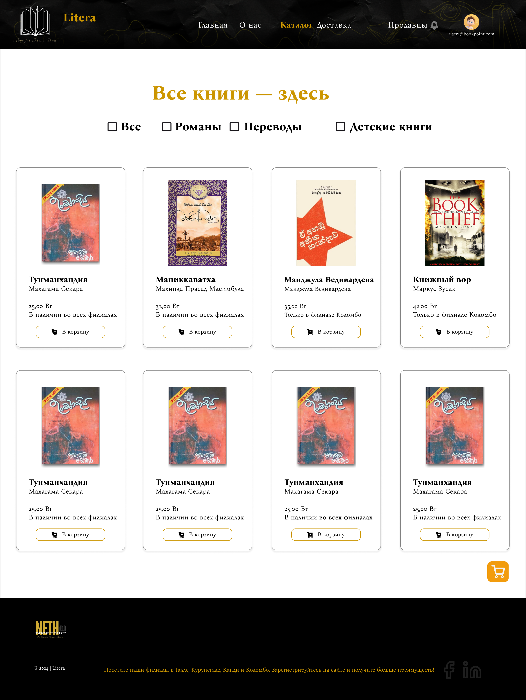
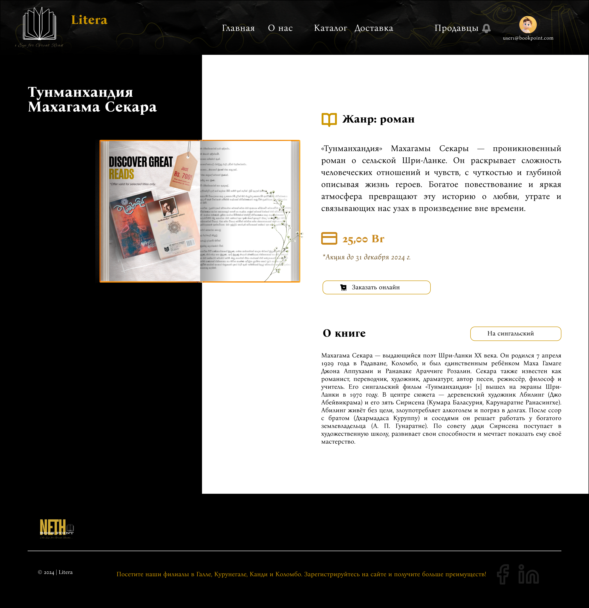
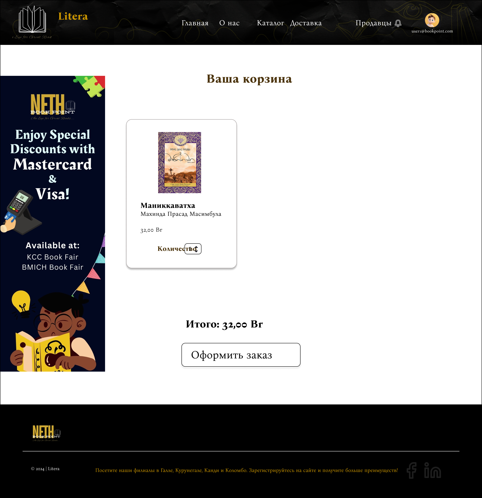
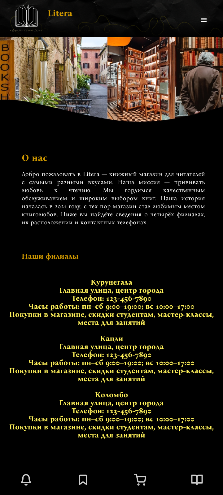

# Лабораторная работа №2

## Проектирование информационной архитектуры и взаимодействия с пользователем

**Дисциплина:** Проектирование человеко-машинных интерфейсов  
**Тема проекта:** Книжный онлайн-магазин «Litera» (каталог и управление заказами)  
**Авторы (группа 12):**  
- Зайдаль Кирилл Андреевич  
- Савицкая Анна-Мария Алексеевна  
**Преподаватель:** Давидовская М. И.  

---

## 1. Дополнение и уточнение разделов лабораторной работы №1

В ходе перехода от предварительного анализа к детальному концептуальному проектированию информационной архитектуры спецификация проекта была уточнена с учетом результатов анкетирования (17 респондентов) и специфики двух платформ (веб и мобайл):

1. **Постановка задачи:** В мобильном приложении акцент смещен на сессионную покупку в один клик и быстрый доступ к сохраненной корзине (устойчивость к обрывам связи), а в веб-версии — на расширенный каталог, сравнение изданий и глубокую фильтрацию по полиграфическим характеристикам.
2. **Стратегия дизайна:** Сформирован строгий отказ от всплывающих рекламных поп-апов и оверлеев в пользу встроенных блоков рекомендаций в карточке и ленте каталога. Введен двухуровневый просмотр карточки: быстрые параметры для мобильных экранов и разворачиваемая спецификация для букинистов и коллекционеров.
3. **Уточненная объектная модель:** Добавлен функциональный объект `Ознакомительный фрагмент` (модальный ридер превью) и `Сессия чекаута` (кэширование состояния оформления).

---

## 2. Концептуальное проектирование и тип интерфейса

Согласно методологии Алана Купера и классификации типов интерфейсов настольных и мобильных систем:

* **Веб-приложение «Litera» (Десктоп):**
  * *Для покупателя:* **Временный тип интерфейса** с элементами монопольного во время целенаправленного оформления заказа. Пользователь приходит для решения конкретной функциональной задачи (найти книгу, прочитать ознакомительный фрагмент, оформить предзаказ) и покидает сервис.
  * *Для менеджера склада:* **Монопольный тип интерфейса**. Панель управления заказами является основным рабочим инструментом сотрудника в течение 8-часовой рабочей смены, требует высокой плотности данных (data-dense UI), табличных реестров и поддержки клавиатурных сокращений.
* **Мобильное приложение «Litera» (iOS/Android):**
  * **Временный тип интерфейса** с высокой частотой прерываний (звонки, мессенджеры, пересадки в транспорте). Требует мгновенной загрузки первого экрана, сохранения фокуса ввода и кэширования локальной корзины.

---

## 3. Информационная архитектура (п. 6 методических указаний)

### 3.1. Система организации контента

#### Аудит и инвентаризация контента

| Единица контента | Тип | Формат | Объем | Владелец | Статус |
| :--- | :--- | :--- | :--- | :--- | :--- |
| Каталог изданий | Структурированные данные | Карточки, сетка, списки | > 50 000 позиций | Контент-менеджер | Динамический |
| Карточка книги | Информационный блок | Текст, WebP-изображения, PDF | 1 страница на ISBN | Издательство / Контентщик | Динамический |
| Ознакомительный фрагмент | Медиа-контент | Интерактивный PDF / HTML-ридер | Первые 15–30 страниц | Издательство / Litera | Статический |
| Отзывы и оценки | Пользовательский контент (UGC) | Текст, рейтинг 1–5 звезд | Десятки на книгу | Покупатели | Модерируемый |
| Корзина и оформление | Функциональный поток | Интерактивная форма, поля ввода | 1 сессия на пользователя | Покупатель / Система | Временный (кэш) |
| Личный кабинет / Заказы | Персональные данные | Таблицы, бейджи статусов, трекинг | 1 профиль на аккаунт | Покупатель | Защищенный |
| Складской реестр | Управленческий контент | Таблицы, фильтры, накладные | Потоковые данные | Менеджер склада | Служебный |

#### Схема организации и принцип группировки

* **Схема организации:** **Фасетная (многомерная)** в сочетании с **иерархической древовидной** структурой каталога. Фасетная классификация позволяет фильтровать книги одновременно по независимым измерениям: жанр, автор, издательство, тип обложки (твердая/мягкая), диапазон цен и статус наличия.
* **Принцип группировки:** Гибридный — по **тематике** (рубрикатор жанров), по **задачам пользователя** (новинки, предзаказы, бестселлеры, акции) и по **формату** (бумажные, электронные, подарочные).

#### Карта сайта (Sitemap — глубина ≥ 3 уровней)



### 3.2. Система именования

#### Словарь терминов интерфейса (Glossary)

| Термин | Определение | Область использования в интерфейсе |
| :--- | :--- | :--- |
| **Каталог** | Полный структурированный перечень доступных изданий с фасетными фильтрами | Главное меню, кнопка вызова рубрикатора |
| **Предзаказ** | Оформление заявки на тираж, находящийся на этапе печати или транспортировки | Карточка книги, баннеры анонсов, фильтр каталога |
| **Ознакомительный фрагмент** | Бесплатный просмотр начальных страниц книги в модальном окне | Кнопка в карточке товара («Читать фрагмент») |
| **Избранное (Вишлист)** | Персональный список отложенных изданий с отслеживанием скидок | Иконка сердца в шапке / навигаторе, карточка товара |
| **Корзина** | Временный контейнер выбранных для покупки товаров с калькуляцией скидок | Кнопка в шапке, плавающая плашка чекаута |
| **Самовывоз** | Доставка заказа в партнерский пункт выдачи или фирменный магазин | Форма выбора способа доставки при чекауте |
| **ISBN** | Международный стандартный книжный номер (уникальный идентификатор) | Блок полиграфических характеристик карточки книги |

#### Структура человекопонятных URL (ЧПУ)

Спроектирована прозрачная иерархическая структура веб-адресов:
* **Каталог жанра:** `litera.by/catalog/fiction/`
* **Поджанр:** `litera.by/catalog/fiction/sci-fi/`
* **Карточка конкретной книги:** `litera.by/book/978-5-17-135848-dune`
* **Страница автора:** `litera.by/author/frank-herbert/`
* **Полнотекстовый поиск:** `litera.by/search?q=архитектура+систем&sort=popular`
* **Корзина и чекаут:** `litera.by/checkout/step-1/`

#### Система меток и пиктограмм (Icons System)
* **Magnifying Glass (Лупа)** — строка и кнопка инициации поиска.
* **Bookmark / Heart (Сердце / Закладка)** — добавление книги в «Избранное».
* **Shopping Bag (Сумка / Корзина)** — просмотр корзины с бейджем количества товаров.
* **Book Open (Раскрытая книга)** — вызов бесплатного ридера фрагмента.
* **Sliders (Ползунки)** — вызов шторки фасетных фильтров на мобильных экранах.

---

### 3.3. Система навигации

#### Уровни навигации

* **Глобальная навигация (Header / Footer / Bottom Bar):**
  * *Веб-интерфейс:* верхняя фиксированная тёмная панель (Логотип Litera со слоганом, ссылки основных разделов: `Главная`, `О нас`, `Каталог`, `Доставка`, служебный раздел `Продавцы` с колокольчиком системных уведомлений и профиль авторизованного пользователя). Нижний колонтитул (Footer): информация о филиалах (Галле, Курунегале, Канди, Коломбо), копирайт, ссылки на социальные сети (Facebook, LinkedIn).
  * *Мобильное приложение:* верхний бар с логотипом и кнопкой меню-гамбургера; нижняя навигационная панель (Bottom Navigation Bar) с ключевыми пиктограммами: Уведомления (Колокольчик), Избранное/Закладки (Bookmark), Корзина (Shopping Cart), Каталог/Чтение (Книга).
* **Локальная навигация:**
  * *В каталоге:* верхний горизонтальный переключатель категорий (чекбоксы быстрого среза: `Все`, `Романы`, `Переводы`, `Детские книги`).
  * *В корзине:* переход между позициями и прямой переход к чекауту кнопкой «Оформить заказ».
* **Контекстная навигация:**
  * *В карточке книги:* выбор языка/перевода («На сингальский»), прямой переход к оформлению («Заказать онлайн»).
  * *На главной странице:* интерактивная витрина «Наш выбор» с пагинацией-точками (dots), блок статистики («800+ книг в каталоге, 1 тыс.+ читателей, 50+ филиалов») с переходом «Подробнее».
* **Вспомогательная навигация:**
  * Плавающая кнопка быстрого перехода в корзину в каталоге.
  * Индикаторы доступности тиражей («В наличии во всех филиалах», «Только в филиале Коломбо»).

---

### 3.4. Система поиска

#### Поисковый интерфейс и архитектура
* **Размещение:** Акцентный поисковый блок в центральной герой-секции (Hero Banner) главной страницы («Мир книг ждёт вас!») с полем ввода и золотистой кнопкой «Поиск».
* **Автодополнение (Саджесты):** Срабатывает при вводе от 2 символов с задержкой debounce 250 мс. Показывает совпадения по названию, автору и наличию по филиалам.
* **Обработка опечаток:** Полнотекстовый нечеткий поиск на базе расстояния Левенштейна.

#### Схема метаданных поиска

| Поле метаданных | Тип поиска | Вес релевантности | Пример значения |
| :--- | :--- | :--- | :--- |
| `title` | Префиксный, нечеткий (Fuzzy) | 10 (Максимальный) | Тунманхандия, Книжный вор |
| `author_name` | Точное совпадение + нечеткий | 9 | Махагама Секара, Маркус Зусак |
| `isbn` | Строгое точное совпадение | 10 | 978-5-17-135848-8 |
| `category` | Категориальный индекс | 8 | Романы, Переводы, Детские книги |
| `branch_stock` | Фильтр филиалов | 6 | Коломбо, Канди, Курунегале |
| `description` | Полнотекстовый морфологический | 3 | Роман о сельской жизни... |

---

## 4. Навигационные модели и общая диаграмма путей (п. 7)

### 4.1. Навигационная модель ключевого персонажа (Алексей, Студент)



### 4.2. Навигационная модель менеджера склада (Марина)



### 4.3. Общая совокупная диаграмма путей системы



---

## 5. Карта влияния (Impact Map) и Карта пути клиента (CJM) (п. 8)

### 5.1. Карта влияния (Impact Map)

Карта связывает стратегическую бизнес-цель интернет-магазина с поведением действующих лиц и конкретными функциональными решениями:



### 5.2. Карта пути клиента (Customer Journey Map — CJM)

**Персонаж:** Алексей (20 лет, студент, покупает со смартфона в общежитии).  
**Цель:** Найти книгу, оценить оформление и заказать онлайн.

| Этап пути | 1. Поиск издания | 2. Оценка книги | 3. Ознакомление | 4. Оформление заказа | 5. Получение и трекинг |
| :--- | :--- | :--- | :--- | :--- | :--- |
| **Действия пользователя** | Вводит название в поисковую строку на баннере | Смотрит карточку в каталоге, цену (25.00 Br) и филиал наличия | Изучает фото разворота страниц и блок аннотации | Нажимает «Заказать онлайн», переходит в корзину | Оформляет заказ, получает номер и забирает в филиале |
| **Точки контакта** | Главный экран, поисковая строка, подборка «Наш выбор» | Каталог, бейдж Special Offer, статус наличия | Карточка издания, интерактивный фоторазворот | Корзина, селектор количества, кнопка «Оформить заказ» | Подтверждение заказа, уведомления |
| **Мысли** | «Надеюсь, найдет быстро и без рекламы» | «Отличная цена, есть в филиале рядом» | «Разворот чёткий, бумага качественная, беру» | «Только бы корзина не сбросилась» | «Заберу заказ в филиале Коломбо» |
| **Эмоциональный статус** | Нейтральный (сосредоточен) | Позитивный (выгодная цена) | Высокий интерес | Сосредоточенность | Удовлетворение и радость |
| **Болевые точки (Pain Points)** | Опечатки в запросе | Непонятно, в каком филиале забирать | Фото страниц может быть размытым | Лишние поля оформления | Очередь в пункте выдачи |
| **Решения интерфейса** | Быстрый поиск и категории-чекбоксы | Бейджи «В наличии во всех филиалах» | Полноразмерный чёткий фоторазворот издания | Лаконичная корзина с пересчётом итога в 1 клик | Быстрая выдача по номеру заказа |

---

## 6. Интерактивные раскадровки и макеты низкой точности (п. 9)

### 6.1. Каркас страницы каталога с категориями (Десктоп Wireframe)

```
+-----------------------------------------------------------------------------------+
| [ Litera Logo ]   Главная   О нас   [КАТАЛОГ]   Доставка   Продавцы 🔔   (👤 Профиль) |
+-----------------------------------------------------------------------------------+
|                              Все книги — здесь                                    |
|             [ ] Все      [ ] Романы      [ ] Переводы      [ ] Детские книги      |
+-----------------------------------------------------------------------------------+
|  +------------------+  +------------------+  +------------------+  +------------+  |
|  | [SPECIAL OFFER]  |  | [ Обложка ]      |  | [ Обложка ]      |  | [Обложка]  |  |
|  | [ Обложка книги] |  |                  |  |                  |  |            |  |
|  | Тунманхандия     |  | Маниккаватха     |  | Манджула Ведива. |  | Книжный вор|  |
|  | Махагама Секара  |  | Махинда Прасад   |  | Манджула Ведивар.|  | Маркус Зу. |  |
|  | 25,00 Br         |  | 32,00 Br         |  | 35,00 Br         |  | 42,00 Br   |  |
|  | В наличии во всех|  | В наличии во всех|  | Только в Коломбо |  | В Коломбо  |  |
|  | [ В корзину ]    |  | [ В корзину ]    |  | [ В корзину ]    |  | [В корзину]|  |
|  +------------------+  +------------------+  +------------------+  +------------+  |
|                                                                       [ 🛒 КОРЗИНА]|
+-----------------------------------------------------------------------------------+
| Футер: Филиалы в Галле, Курунегале, Канди и Коломбо. © 2024 Litera    [fb] [in]   |
+-----------------------------------------------------------------------------------+
```

### 6.2. Каркас мобильной версии интерфейса (Мобильный Wireframe — 390px)

```
+-----------------------------------+
| [ Litera Logo ]              [ ☰ ]|
+-----------------------------------+
| [ Фото интерьера книжного пассажа]|
|                                   |
| О нас                             |
| Добро пожаловать в Litera —       |
| книжный магазин для читателей с   |
| самыми разными вкусами...         |
|                                   |
| Наши филиалы                      |
| * Курунегала (Главная ул., центр) |
|   Тел: 123-456-7890 | 9:00-19:00   |
| * Канди (Главная ул., центр)      |
|   Тел: 123-456-7890 | 9:00-19:00   |
| * Коломбо (Главная ул., центр)    |
|   Тел: 123-456-7890 | 9:00-19:00   |
+-----------------------------------+
|  [ 🔔 ]    [ 🔖 ]    [ 🛒 ]   [ 📖 ]| (Bottom Navigation Bar)
+-----------------------------------+
```

---

## 7. Спецификация дизайн-макетов в Figma (п. 10)

Для реализации цветных прототипов в Figma определены следующие стандарты дизайн-системы, полностью соответствующие представленным макетам:

### Концепция визуального стиля и тема

* **Визуальная стилистика:** **Classic Bookstore / Dark Premium**. Сочетание глубокого темного фона, благородного золотого акцента и традиционной книжной эстетики (гравюрный логотип с раскрытой книгой, текстурированный фон, качественные фоторазвороты страниц).

### Сетки и базовые фреймы

* **Десктопная версия (Web Desktop):**
  * Ширина фрейма: 1440 px (высота страниц: 1024–2800 px).
  * Сетка: 12-колоночная модульная сетка с центральным выравниванием контентных контейнеров (Container max-width: 1200 px, поля: auto).
* **Мобильная версия (Mobile Layout):**
  * Ширина фрейма: 390 x 844 px (пропорции современных смартфонов).
  * Сетка: Одноколоночная гибкая верстка, боковые поля (Margins): 16–20 px, Thumb Zone навигация в нижней панели.

### Цветовая палитра и типографика

* **Background (Фон страниц и секций):** `#0A0A0A` / `#000000` (Глубокий темный фон с текстурой); `#FFFFFF` (Белый фон контентной подложки карточки издания для читаемости текста аннотации).
* **Primary / Accent (Золотой / Янтарный):** `#D4AF37` / `#EAB308` (Золотистый цвет логотипа, акцентных заголовков, рамок кнопок поиска и акционных бейджей `SPECIAL OFFER`).
* **Secondary Action (Кнопки действий и Корзина):** `#F59E0B` / `#D97706` (Яркий теплый золотисто-оранжевый — плавающая кнопка корзины, бейджи скидок).
* **Card Background (Карточки каталога):** `#FFFFFF` с мягким скруглением углов (Border Radius: 12px) и тонкой контрастной обводкой `#E2E8F0`.
* **Text Colors:**
  * По темному фону: `#FFFFFF` (Основной текст), `#FBBF24` / `#FCD34D` (Акцентные заголовки и цены).
  * По светлому фону: `#111827` (Текст описания книги), `#4B5563` (Второстепенные характеристики).
* **Типографика:**
  * **Заголовки (Headings & Display):** Классическая антиква с засечками (**Serif** — стиль *Playfair Display / Merriweather / Georgia*) — подчеркивает книжную тематику и академичность.
  * **Интерфейсный текст (UI, кнопки, метаданные):** Читаемый гротеск (**Sans-serif** — стиль *Inter / Roboto*) для цен, кнопок и навигационных меню.

### Ссылка на проект и исходники

* **Figma Project:** [Интерактивный макет Litera UI Prototype в Figma](https://www.figma.com/design/KK4tOZ6qzUXQNjqm5JUyrd/Book-Store-Web-App--Community-?node-id=0-1&t=qtcHEFlIr0Fitx6B-1)

#### Разработанные интерфейсы (скриншоты макетов):

* **Главная страница:**
  

* **Страница каталога:**
  

* **Карточка книги:**
  

* **Корзина и оформление:**
  

* **Мобильная версия:**
  

---

## 8. Общие выводы по лабораторной работе №2

1. Спроектирована целостная информационная архитектура веб- и мобильного приложения книжного онлайн-магазина «Litera», объединяющая фасетную каталогизацию и иерархическую карту сайта глубиной в 4 уровня.
2. Разработана система именования и единый терминологический словарь (Glossary), исключающий двусмысленность при навигации пользователя.
3. Сформирована сквозная система навигации (глобальная, локальная, контекстная и хлебные крошки), адаптированная под мобильный эргономический паттерн зоны досягаемости большого пальца (Thumb Zone).
4. Разработанная поисковая модель с автодополнением и нечетким поиском по метаданным решает ключевую проблему 100% опрошенных пользователей, использующих прямой поиск по автору и названию.
5. Построены Customer Journey Map (CJM) и Impact Map, позволившие выявить критические точки оттока на этапе чекаута и заложить требования к локальному кэшированию сессии оформления заказа.
