# Лабораторная работа №3

## Разработка требований и архитектурная спецификация программной системы «Litera»

**Дисциплина:** Проектирование человеко-машинных интерфейсов  
**Тема проекта:** Кроссплатформенный книжный онлайн-магазин «Litera» (Web, Mobile, Server)  
**Авторы (группа 12):**  
- Зайдаль Кирилл Андреевич  
- Савицкая Анна-Мария Алексеевна  
**Преподаватель:** Давидовская М. И.  

---

## 1. Введение и цели работы

**Цели лабораторной работы:**
1. Разработать функциональные и нефункциональные требования к программной системе «Litera» в виде пользовательских историй (User Stories) с критериями приемки (Acceptance Criteria) по методологии BDD (Given-When-Then / Gherkin).
2. Спроектировать спецификацию поведения и структуры системы с использованием языков описания диаграмм **PlantUML** и **Mermaid**.
3. Продемонстрировать применение ИИ-агентов и системных промптов (System Analyst AI Skills) для расширения требований и генерации диаграмм.
4. Выполнить событийное проектирование предметной области методами **EventStorming** (Big Picture, Process Modeling, Software Design) и **Event Modeling** (Command, View, Automation, Translation patterns).
5. Спроектировать многоуровневую архитектуру программного комплекса на основе подхода **C4 Model** (Context, Container, Component).
6. Оформить комплексное техническое задание на разработку приложений в соответствии с международным стандартом **SRS (Software Requirements Specification)** по Карлу Вигерсу.

> **Примечание по отображению диаграмм:**  
> Так как стандартный генератор статических сайтов GitHub Pages не поддерживает нативный рендеринг блоков кода Mermaid и PlantUML в браузере, все диаграммы в данном отчете представлены в виде **высококачественных векторно-растрированных скриншотов/иллюстраций**, сопровождаемых раскрывающимися блоками с эталонным исходным кодом спецификации.

---

## 2. Задание 1. Разработка требований в виде пользовательских историй (User Story)

### 2.1. Краткое описание системы и ролей пользователей
Программный комплекс **«Litera»** представляет собой кроссплатформенный книжный онлайн-магазин, объединяющий десктопный адаптивный веб-портал, нативное мобильное приложение и серверную микросервисную платформу управления складскими запасами и заказами.

В системе выделены следующие ключевые роли пользователей:
1. **Гость (Новый пользователь):** Неавторизованный посетитель витрины. Основная цель — быстрый поиск, изучение аннотаций, чтение ознакомительного фрагмента, добавление в корзину без обязательной предварительной регистрации.
2. **Зарегистрированный клиент (Постоянный покупатель):** Авторизованный пользователь. Обладает сохраненными адресами доставки/ПВЗ, историей покупок, виш-листом и возможностью мгновенного чекаута, в том числе в офлайн-режиме мобильного клиента.
3. **Менеджер склада (Комплектовщик):** Внутренний корпоративный пользователь. Выполняет сборку сформированных заказов с помощью терминала сбора данных (ТСД) / штрихкод-сканера, контролирует остатки в филиалах и изменяет статусы логистических отправлений.
4. **Контент-менеджер / Администратор:** Управляет каталогом изданий, загружает превью-фрагменты, регулирует цены и маркетинговые акции.

---

### 2.2. Пользовательские истории (User Stories), критерии приёмки и обоснование приоритетов

#### Сценарий 1. Поиск книг и ознакомление с фрагментом произведения

##### US-01: Поиск и интеллектуальная фильтрация в каталоге
* **Формулировка:**  
  *Как* потенциальный покупатель (Гость или Клиент),  
  *я хочу* находить книги по названию, автору или ISBN с возможностью мгновенной фильтрации по жанрам, формату издания и наличию в конкретном филиале,  
  *чтобы* за минимальное время подобрать интересующую книгу и узнать, где ее можно забрать сегодня.
* **Приоритет:** **High**  
  *Обоснование:* Каталог и поиск — главный конверсионный шлюз интернет-магазина. Без быстрого и точного поиска пользователь покидает сервис в течение первых 10–15 секунд.
* **Зависимости:** Базовая сущность `Book` и поисковый индекс в БД.
* **Acceptance Criteria (Критерии приёмки):**
  1. **AC-01.1 (Поисковая выдача):** При вводе от 3 символов система должна отображать саджесты (подсказки) в реальном времени не позднее чем через 250 мс.
  2. **AC-01.2 (Фильтрация филиала):** При выборе фильтра «Самовывоз сегодня в ТЦ Галерея» список отображает только позиции с `stock_quantity > 0` для выбранной точки.
  3. **AC-01.3 (Ошибки ввода):** Поисковый движок осуществляет нечеткий поиск (fuzzy search), исправляя типичные опечатки в фамилиях авторов (например, «Достоевский» при вводе «Дастоевский»).
  4. **AC-01.4 (Пагинация и скролл):** Поддерживается бесшовная подгрузка результатов (infinite scroll на мобайле, постраничная навигация с сохранением URL на вебе).
  5. **AC-01.5 (Сохранение состояния):** При переходе в карточку книги и возврате назад позиция скролла и выбранные фильтры не сбрасываются.

##### US-02: Интерактивное чтение ознакомительного фрагмента
* **Формулировка:**  
  *Как* читатель,  
  *я хочу* открыть и пролистать первые 15–20 страниц книги прямо в карточке товара без скачивания сторонних файлов,  
  *чтобы* оценить качество верстки, слог автора и принять взвешенное решение о покупке.
* **Приоритет:** **Medium**  
  *Обоснование:* Повышает доверие к изданию и увеличивает конверсию в заказ на 18–25% (по данным продуктовых исследований), но не блокирует базовый поток покупки.
* **Зависимости:** US-01 (найденная карточка книги).
* **Acceptance Criteria (Критерии приёмки):**
  1. **AC-02.1 (Формат превью):** Ознакомительный фрагмент открывается в модальном оверлее (Web) или отдельном полноэкранном ридере (Mobile) за время < 1.0 с.
  2. **AC-02.2 (Безопасность контента):** Исходный PDF/ePub защищен от прямого несанкционированного скачивания (отключено контекстное меню сохранения, рендеринг через векторный canvas/webgl).
  3. **AC-02.3 (Индикация окончания):** На последней странице фрагмента отображается баннер с кнопкой «Купить полную версию за N BYN».
  4. **AC-02.4 (Настройки отображения):** Пользователь может переключить тему ридера (светлая/сепия/темная) и настроить размер шрифта.

---

#### Сценарий 2. Оформление заказа и экспресс-оплата

##### US-03: Корзина и кросс-девайсная синхронизация
* **Формулировка:**  
  *Как* покупатель,  
  *я хочу* управлять товарами в корзине (изменять количество, удалять, видеть автоматический пересчет итоговой суммы) с сохранением состояния между устройствами,  
  *чтобы* набрать книги на смартфоне в дороге, а завершить оформление с ноутбука дома.
* **Приоритет:** **High**  
  *Обоснование:* Ядро транзакционного цикла магазина. Любая потеря товаров в корзине приводит к гарантированному оттоку клиента.
* **Зависимости:** US-01.
* **Acceptance Criteria (Критерии приёмки):**
  1. **AC-03.1 (Гостевая корзина):** Добавление товаров гостем сохраняется в `LocalStorage` (Web) или локальной `SQLite` (Mobile) с временем жизни не менее 30 дней.
  2. **AC-03.2 (Слияние при входе):** При авторизации гостя локальная корзина автоматически объединяется с его серверной корзиной без перезаписи и дублирования.
  3. **AC-03.3 (Контроль лимитов остатков):** При попытке установить количество больше, чем доступно на центральном складе, система выводит тост: «Доступно только X экз.».
  4. **AC-03.4 (Пересчет скидок):** Итоговая стоимость автоматически пересчитывается при вводе промокода или списании бонусных баллов.

##### US-04: Онлайн-оплата и выбор варианта доставки
* **Формулировка:**  
  *Как* зарегистрированный клиент,  
  *я хочу* выбрать самовывоз из филиала сети либо курьерскую доставку и безопасно оплатить заказ банковской картой онлайн (или через СБП),  
  *чтобы* гарантированно зарезервировать книги и не тратить время на расчеты при получении.
* **Приоритет:** **High**  
  *Обоснование:* Финализация сделки и получение выручки.
* **Зависимости:** US-03 (наличие товаров в корзине), US-05 (профиль клиента для автозаполнения).
* **Acceptance Criteria (Критерии приёмки):**
  1. **AC-04.1 (Резервирование склада):** В момент нажатия «Оплатить» книги блокируются в остатках на 15 минут (таймаут платежной сессии).
  2. **AC-04.2 (Платежный шлюз):** Клиент перенаправляется на защищенную страницу банка (3D-Secure 2.0). Приложение не хранит полные реквизиты карт (PCI DSS compliance).
  3. **AC-04.3 (Обработка сбоя):** При отклонении транзакции банком заказ переходит в статус «Ожидает оплаты», а товары не сбрасываются из корзины в течение 30 минут.
  4. **AC-04.4 (Чек и подтверждение):** После успешной оплаты генерируется электронный фискальный чек, а пользователю отправляется Push и Email с номером заказа.

---

#### Сценарий 3. Складская логистика и сборка заказов персоналом

##### US-05: Сборка заказа комплектовщиком по штрихкоду
* **Формулировка:**  
  *Как* менеджер склада (комплектовщик),  
  *я хочу* видеть реестр оплаченных заказов и с помощью сканера штрихкодов валидировать каждую собранную книгу,  
  *чтобы* исключить пересорт и отправить заказ покупателю без ошибок комплектации.
* **Приоритет:** **High**  
  *Обоснование:* Качество исполнения заказов определяет репутацию магазина и минимизирует затраты на возвраты.
* **Зависимости:** US-04 (заказ должен иметь статус `PAID`).
* **Acceptance Criteria (Критерии приёмки):**
  1. **AC-05.1 (Очередь заказов):** Список формируется по алгоритму FIFO с визуальной цветовой индикацией срочности (заказы с экспресс-доставкой подсвечены красным).
  2. **AC-05.2 (Валидация сканирования):** При сканировании штрихкода (ISBN книги) позиция в чек-листе автоматически помечается зеленой галочкой; при неверной книге раздается громкий сигнал ошибки.
  3. **AC-05.3 (Завершение сборки):** Кнопка «Завершить сборку» становится активной строго после подтверждения 100% позиций сборочного листа.
  4. **AC-05.4 (Смена статуса):** После завершения сборки статус заказа в системе автоматически меняется на `READY_FOR_PICKUP` (или `IN_DELIVERY`), что инициирует SMS клиенту.

---

### 2.3. Платформенные различия (Сводная матрица Web vs Mobile)

| Критерий / Аспект | Веб-интерфейс («Litera Web») | Мобильное приложение («Litera Mobile») |
| :--- | :--- | :--- |
| **Разрешение и ориентация** | Адаптивная верстка (от 1024px до 4K), фиксация сайдбара фильтров, табличные сетки. | Портретная ориентация (360x800+), адаптация под "челку" (Safe Area), нижний TabBar (bottom navigation). |
| **Жесты и управление** | Клик мышью, колесо прокрутки, ховер-эффекты карточек, тултипы. | Свайпы (удаление из корзины, листание страниц превью), pull-to-refresh, pinch-to-zoom обложки. |
| **Офлайн-функциональность** | Минимальная (Service Worker кэширует базовые статические ассеты, при обрыве — экран «Нет сети»). | **Полноценная**: локальная БД SQLite хранит сохраненные книги и корзину; синхронизация при появлении сети. |
| **Аппаратные датчики** | Нет прямого доступа (только Geolocation API браузера с явным запросом). | Использование камеры смартфона как сканера штрихкодов/ISBN, биометрия (FaceID/Fingerprint) для входа. |
| **Уведомления** | Браузерные Web Push (требуют явного разрешения) + Email-рассылка. | Системные нативные Push-уведомления (FCM / APNs) со звуком, виброоткликом и бейджами на иконке. |
| **Доступность и ввод** | Полная поддержка WCAG 2.1 AA, навигация с клавиатуры (Tab, Enter, Esc), шорткаты (`/` — фокус поиска). | Адаптация под системный масштаб шрифта Dynamic Type, поддержка TalkBack / VoiceOver, сенсорные мишени $\ge 48\times 48$ dp. |

---

### 2.4. Распределение ролей в команде проекта
- **Зайдаль Кирилл:** Проектирование требований для серверной платформы и веб-интерфейса, моделирование бизнес-процессов EventStorming, разработка диаграмм C4 Model и ERD базы данных.
- **Савицкая Анна-Мария:** Разработка требований к мобильному клиенту, спецификация пользовательских историй и критериев BDD, моделирование прецедентов (Use Case) и диаграмм последовательности (Sequence Diagrams), оформление раздела SRS.

---

## 3. Задания 2–3. Базовые спецификации системы на PlantUML и Mermaid

### 3.1. Диаграмма прецедентов (Use Case Diagram)
Диаграмма вариантов использования отражает границы системы «Litera» и взаимодействие четырех основных категорий пользователей с целевыми сценариями.

#### Вариант на языке PlantUML
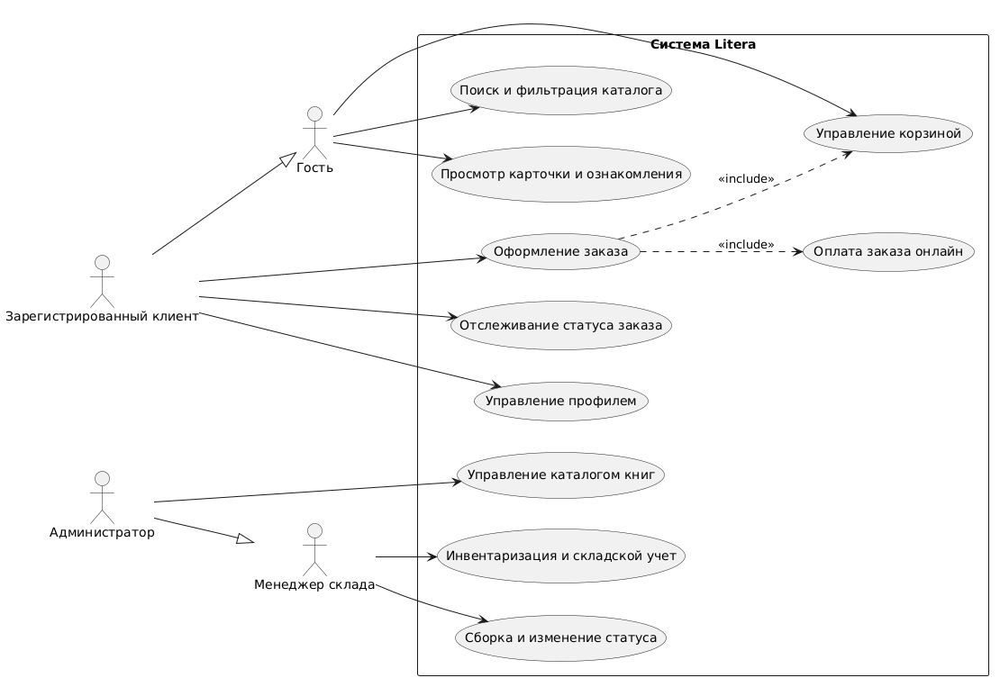

<details>
<summary>Показать исходный код PlantUML (Use Case)</summary>

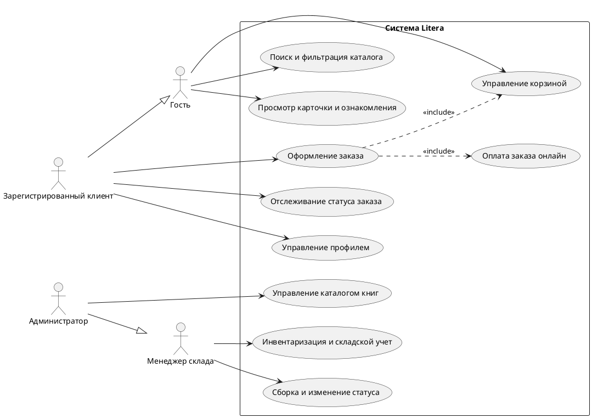
```plantuml
@startuml
left to right direction
actor Guest as "Гость"
actor User as "Зарегистрированный клиент"
actor Manager as "Менеджер склада"
actor Admin as "Администратор"

rectangle "Система Litera" {
    usecase UC_Search as "Поиск и фильтрация каталога"
    usecase UC_Preview as "Просмотр карточки и ознакомления"
    usecase UC_Cart as "Управление корзиной"
    usecase UC_Checkout as "Оформление заказа"
    usecase UC_Pay as "Оплата заказа онлайн"
    usecase UC_Track as "Отслеживание статуса заказа"
    usecase UC_Profile as "Управление профилем"
    usecase UC_ManageOrders as "Сборка и изменение статуса"
    usecase UC_Inventory as "Инвентаризация и складской учет"
    usecase UC_AdminBooks as "Управление каталогом книг"
}

Guest --> UC_Search
Guest --> UC_Preview
Guest --> UC_Cart

User --|> Guest
User --> UC_Checkout
User --> UC_Track
User --> UC_Profile

UC_Checkout ..> UC_Pay : <<include>>
UC_Checkout ..> UC_Cart : <<include>>

Manager --> UC_ManageOrders
Manager --> UC_Inventory

Admin --|> Manager
Admin --> UC_AdminBooks
@enduml
```
</details>

---

#### Вариант на языке Mermaid
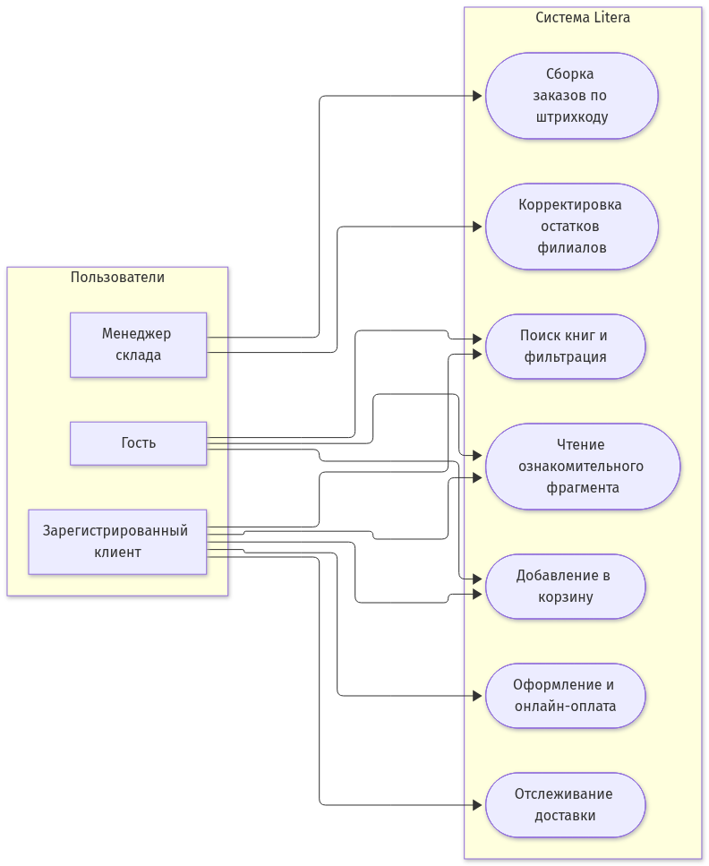

<details>
<summary>Показать исходный код Mermaid (Use Case)</summary>

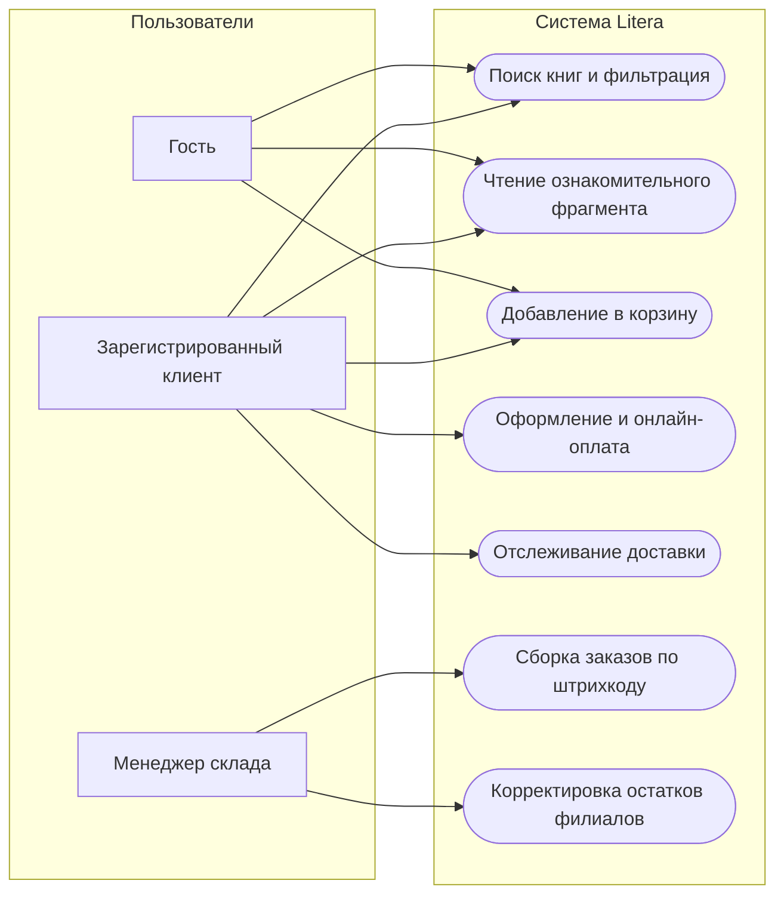
```mermaid
flowchart LR
    subgraph Users[Пользователи]
        Guest[Гость]
        Customer[Зарегистрированный клиент]
        Manager[Менеджер склада]
    end

    subgraph Litera_System[Система Litera]
        UC1([Поиск книг и фильтрация])
        UC2([Чтение ознакомительного фрагмента])
        UC3([Добавление в корзину])
        UC4([Оформление и онлайн-оплата])
        UC5([Отслеживание доставки])
        UC6([Сборка заказов по штрихкоду])
        UC7([Корректировка остатков филиалов])
    end

    Guest --> UC1
    Guest --> UC2
    Guest --> UC3

    Customer --> UC1
    Customer --> UC2
    Customer --> UC3
    Customer --> UC4
    Customer --> UC5

    Manager --> UC6
    Manager --> UC7
```
</details>

---

#### Детальные сценарии вариантов использования (Use Case Specifications)

В соответствии с алгоритмом описания функциональных требований в формате Use Case, ниже представлены спецификации ключевых сценариев использования системы:

##### Сценарий UC-1: Поиск и подбор книг в каталоге
* **Идентификатор и название:** UC-1 «Поиск и фильтрация каталога».
* **Действующие лица (Actors):** Гость, Зарегистрированный клиент.
* **Предусловия (Preconditions):** Система запущена, сервис каталога и поисковый индекс доступны.
* **Триггер (Trigger):** Пользователь вводит текст в поисковую строку или выбирает параметры в панели фильтров.
* **Основной поток событий (Main Success Scenario):**
  1. Пользователь переходит на витрину и вводит в строку поиска название, автора или ISBN (от 3 символов).
  2. Система отправляет асинхронный запрос и отображает выпадающий список релевантных подсказок (саджестов) за время < 250 мс.
  3. Пользователь выбирает подсказку либо нажимает `Enter` / кнопку «Найти».
  4. Пользователь применяет фильтры: жанр «Классика», филиал «Самовывоз сегодня в ТЦ Галерея».
  5. Система обновляет выдачу товаров с учетом наличия на выбранном складе.
  6. Пользователь кликает по карточке найденной книги для перехода к ознакомлению и заказу.
* **Альтернативные потоки (Alternative Flows):**
  * *1a. Опечатка в поисковом запросе:* Поисковый движок применяет алгоритм нечеткого поиска (fuzzy match), выводит предупреждение «Возможно, вы имели в виду: ...» и показывает скорректированную выдачу.
  * *1b. Книга отсутствует в выбранном филиале:* Система предлагает опцию «Заказать перемещение с центрального склада (доставка 1–2 дня)» либо доставку курьером.
* **Постусловия (Postconditions):** Пользователь получил список книг, соответствующих критериям, состояние фильтров сохранено в URL страницы.

##### Сценарий UC-2: Оформление заказа и онлайн-оплата
* **Идентификатор и название:** UC-2 «Оформление и онлайн-оплата заказа».
* **Действующие лица (Actors):** Зарегистрированный клиент, Платежный шлюз банка, Служба складского учета.
* **Предусловия (Preconditions):** Пользователь авторизован, в корзине находится не менее одной книги с подтвержденным наличием на складе.
* **Триггер (Trigger):** Пользователь нажимает кнопку «Перейти к оформлению» в корзине.
* **Основной поток событий (Main Success Scenario):**
  1. Система открывает экран оформления заказа с предзаполненными контактными данными из профиля.
  2. Пользователь выбирает способ получения (Самовывоз из филиала) и способ оплаты (Банковская карта онлайн).
  3. Пользователь нажимает кнопку «Оплатить заказ».
  4. Система временно блокирует (резервирует) заказанные позиции на складе на 15 минут и создает заказ со статусом `CREATED`.
  5. Система перенаправляет клиента на платежную форму банка по защищенному протоколу.
  6. Клиент вводит реквизиты карты и подтверждает списание одноразовым кодом 3D-Secure.
  7. Банк присылает вебхук об успешном списании средств.
  8. Система переводит статус заказа в `PAID`, списывает зарезервированные книги и передает заказ на склад.
  9. Система формирует электронный фискальный чек и отображает экран подтверждения с номером заказа.
* **Альтернативные потоки (Alternative Flows):**
  * *4a. Товар раскуплен во время оформления:* Система отменяет оформление, информирует пользователя о нехватке остатка и предлагает скорректировать корзину.
  * *6a. Отклонение транзакции банком:* Система переводит заказ в статус `PAYMENT_FAILED`, выводит понятное сообщение об ошибке (недостаточно средств / таймаут 3DS) и оставляет корзину активной в течение 30 минут для повторной попытки.
* **Постусловия (Postconditions):** Средства списаны, книги зарезервированы, сформирована накладная на сборку, клиенту отправлено уведомление.

##### Сценарий UC-3: Комплектация заказа на складе по штрихкоду
* **Идентификатор и название:** UC-3 «Сборка заказа комплектовщиком по штрихкоду».
* **Действующие лица (Actors):** Менеджер склада (Комплектовщик), Терминал сбора данных (ТСД).
* **Предусловия (Preconditions):** Менеджер авторизован в складском приложении, в системе есть заказы в статусе `PAID`.
* **Триггер (Trigger):** Комплектовщик выбирает заказ из очереди «Готовы к сборке» и нажимает «Начать комплектацию».
* **Основной поток событий (Main Success Scenario):**
  1. Система переводит заказ в статус `IN_ASSEMBLY` и выводит сборочный лист с указанием стеллажа, полки и ISBN каждой книги.
  2. Комплектовщик берет книгу с полки и сканирует встроенным сканером ТСД (или камерой смартфона) штрихкод книги.
  3. Система сопоставляет отсканированный ISBN с позицией заказа, проигрывает сигнал подтверждения и отмечает позицию зеленой отметкой (1/1).
  4. Комплектовщик повторяет операцию сканирования для всех позиций заказа.
  5. После 100% подтверждения всех книг система активирует кнопку «Завершить сборку».
  6. Комплектовщик упаковывает книги в сейф-пакет и нажимает «Завершить сборку».
  7. Система переводит заказ в статус `READY_FOR_PICKUP` (для самовывоза) или `IN_DELIVERY` (для курьера).
  8. Система генерирует почтовое/Push уведомление покупателю: «Ваш заказ собран и готов к выдаче!».
* **Альтернативные потоки (Alternative Flows):**
  * *3a. Отсканирован неверный штрихкод (пересорт):* Система выводит предупреждающее модальное окно с громким звуковым сигналом: «Ошибка! Книга [Название] не входит в текущий заказ».
  * *3b. Обнаружен типографский брак экземпляра:* Комплектовщик нажимает «Брак», система фиксирует инцидент, списывает экземпляр в дефектный фонд и отправляет запрос на выдачу книги из резервного стеллажа.
* **Постусловия (Postconditions):** Заказ физически упакован, статус заказа обновлен, остатки склада окончательно скорректированы.

##### Сценарий UC-4: Офлайн-чтение ознакомительного фрагмента и синхронизация
* **Идентификатор и название:** UC-4 «Офлайн-чтение фрагмента и отложенная синхронизация прогресса».
* **Действующие лица (Actors):** Зарегистрированный клиент, Мобильный клиент «Litera Mobile».
* **Предусловия (Preconditions):** Ранее загруженный ознакомительный фрагмент кэширован в локальной базе данных SQLite мобильного приложения.
* **Триггер (Trigger):** Пользователь открывает приложение при отсутствии интернет-соединения (Airplane mode / нет связи).
* **Основной поток событий (Main Success Scenario):**
  1. Пользователь заходит в раздел «Мои фрагменты».
  2. Мобильное приложение считывает кэшированные метаданные и файл из локальной песочницы SQLite/FS.
  3. Пользователь открывает встроенный ридер, читает текст и перелистывает страницы жестами (свайпами).
  4. Локальный движок сохраняет текущий номер страницы и заметки во внутреннем журнале состояния с флагом `synced = false`.
  5. При появлении подключения к сети фоновый наблюдатель `NetworkStatusWatcher` отправляет накопленные данные синхронизации на серверный эндпоинт `/api/v1/reader/sync`.
  6. Сервер подтверждает слияние, локальный флаг переключается в `synced = true`.
* **Альтернативные потоки (Alternative Flows):**
  * *2a. Пользователь пытается открыть фрагмент, не загруженный ранее:* Приложение отображает дружественный экран-заглушку с сообщением: «Этот фрагмент не сохранен офлайн. Подключитесь к интернету для загрузки».
* **Постусловия (Postconditions):** Прогресс чтения сохранен локально и бесшовно синхронизирован с облачным профилем читателя.

---

#### Диаграмма последовательности на языке Mermaid (Sequence Diagram)
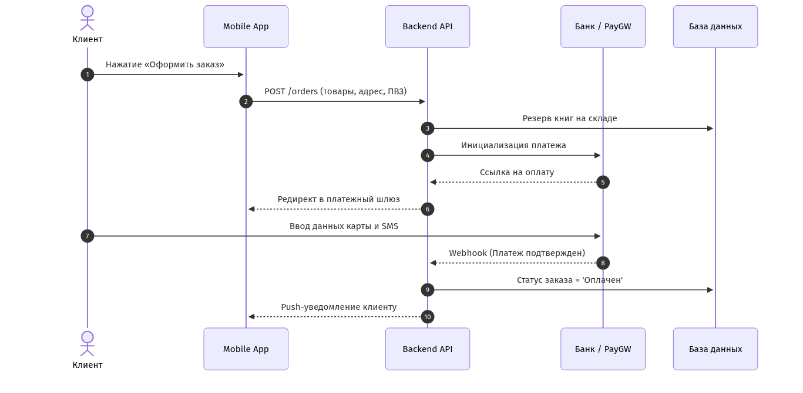

<details>
<summary>Показать исходный код Mermaid (Sequence Diagram)</summary>

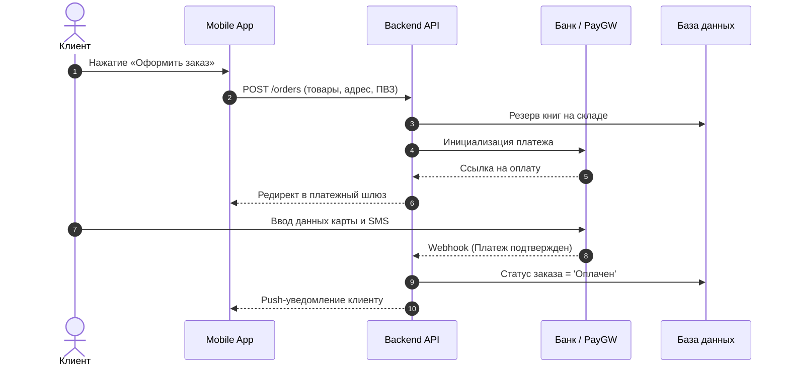
```mermaid
sequenceDiagram
    autonumber
    actor Client as Клиент
    participant Mobile as Mobile App
    participant API as Backend API
    participant Bank as Банк / PayGW
    participant DB as База данных

    Client->>Mobile: Нажатие «Оформить заказ»
    Mobile->>API: POST /orders (товары, адрес, ПВЗ)
    API->>DB: Резерв книг на складе
    API->>Bank: Инициализация платежа
    Bank-->>API: Ссылка на оплату
    API-->>Mobile: Редирект в платежный шлюз
    Client->>Bank: Ввод данных карты и SMS
    Bank-->>API: Webhook (Платеж подтвержден)
    API->>DB: Статус заказа = 'Оплачен'
    API-->>Mobile: Push-уведомление клиенту
```
</details>

---

### 3.2. Диаграммы деятельности (Activity Diagrams)

#### Процесс оформления и онлайн-оплаты заказа (Checkout)
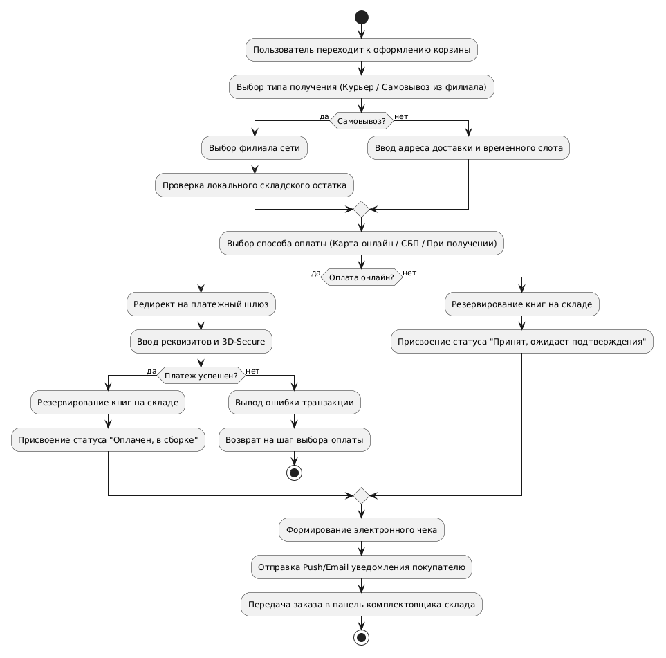

<details>
<summary>Показать исходный код PlantUML (Activity Checkout)</summary>

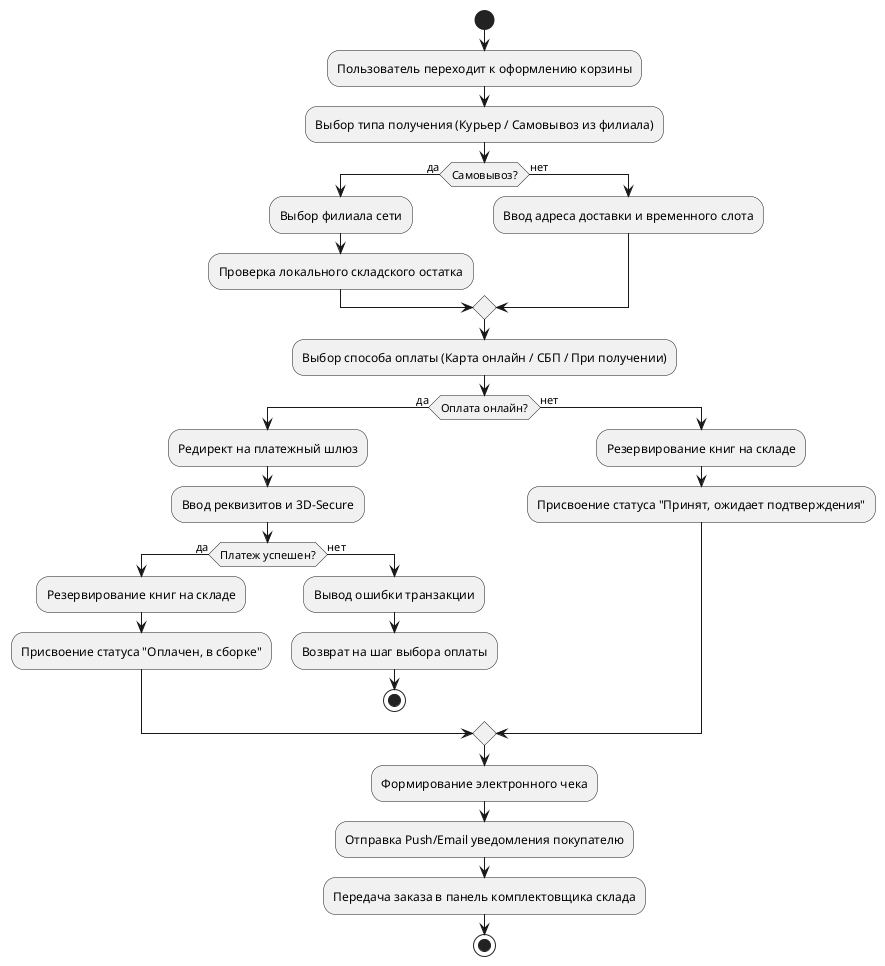
```plantuml
@startuml
start
:Пользователь переходит к оформлению корзины;
:Выбор типа получения (Курьер / Самовывоз из филиала);
if (Самовывоз?) then (да)
  :Выбор филиала сети;
  :Проверка локального складского остатка;
else (нет)
  :Ввод адреса доставки и временного слота;
endif

:Выбор способа оплаты (Карта онлайн / СБП / При получении);
if (Оплата онлайн?) then (да)
  :Редирект на платежный шлюз;
  :Ввод реквизитов и 3D-Secure;
  if (Платеж успешен?) then (да)
    :Резервирование книг на складе;
    :Присвоение статуса "Оплачен, в сборке";
  else (нет)
    :Вывод ошибки транзакции;
    :Возврат на шаг выбора оплаты;
    stop
  endif
else (нет)
  :Резервирование книг на складе;
  :Присвоение статуса "Принят, ожидает подтверждения";
endif

:Формирование электронного чека;
:Отправка Push/Email уведомления покупателю;
:Передача заказа в панель комплектовщика склада;
stop
@enduml
```
</details>

---

#### Процесс сборки заказа на складе по штрихкоду
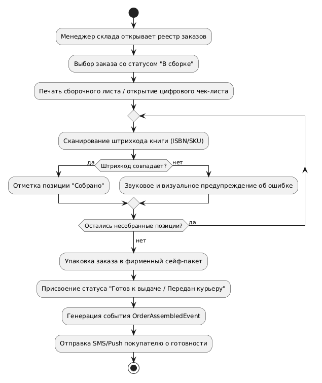

<details>
<summary>Показать исходный код PlantUML (Activity Warehouse)</summary>

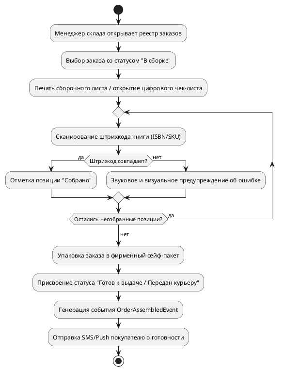
```plantuml
@startuml
start
:Менеджер склада открывает реестр заказов;
:Выбор заказа со статусом "В сборке";
:Печать сборочного листа / открытие цифрового чек-листа;
repeat
  :Сканирование штрихкода книги (ISBN/SKU);
  if (Штрихкод совпадает?) then (да)
    :Отметка позиции "Собрано";
  else (нет)
    :Звуковое и визуальное предупреждение об ошибке;
  endif
repeat while (Остались несобранные позиции?) is (да)
->нет;
:Упаковка заказа в фирменный сейф-пакет;
:Присвоение статуса "Готов к выдаче / Передан курьеру";
:Генерация события OrderAssembledEvent;
:Отправка SMS/Push покупателю о готовности;
stop
@enduml
```
</details>

---

#### Офлайн-чтение и фоновая синхронизация прогресса


<details>
<summary>Показать исходный код PlantUML (Activity Offline Sync)</summary>

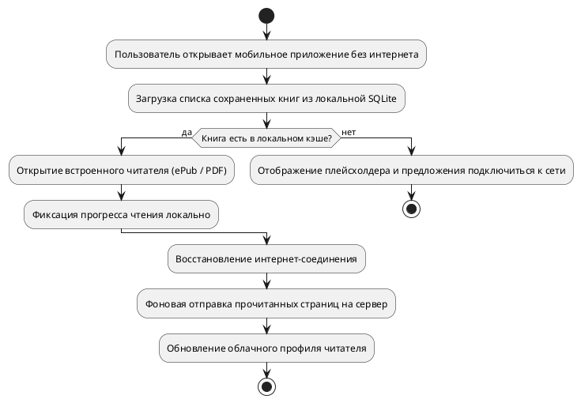
```plantuml
@startuml
start
:Пользователь открывает мобильное приложение без интернета;
:Загрузка списка сохраненных книг из локальной SQLite;
if (Книга есть в локальном кэше?) then (да)
  :Открытие встроенного читателя (ePub / PDF);
  :Фиксация прогресса чтения локально;
else (нет)
  :Отображение плейсхолдера и предложения подключиться к сети;
  stop
endif

:Восстановление интернет-соединения;
:Фоновая отправка прочитанных страниц на сервер;
:Обновление облачного профиля читателя;
stop
@enduml
```
</details>

---

### 3.3. Диаграмма классов (Class Diagram)

#### Доменная модель предметной области (PlantUML)
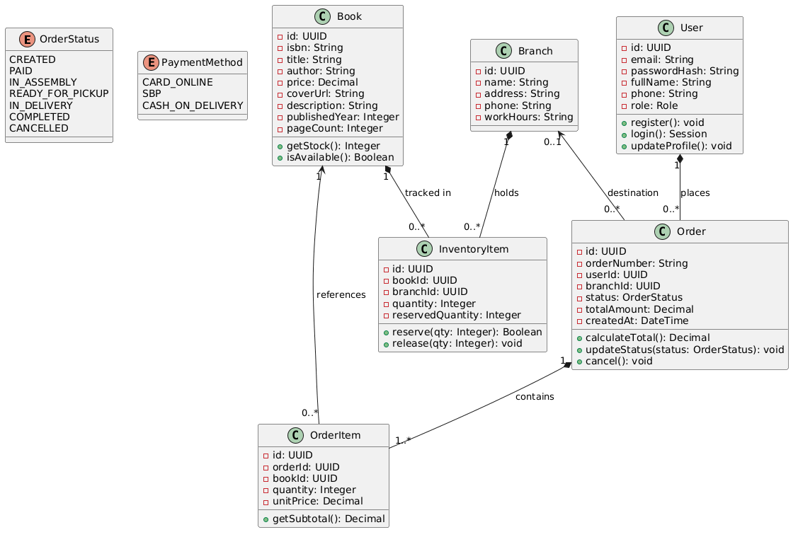

<details>
<summary>Показать исходный код PlantUML (Domain Class Diagram)</summary>

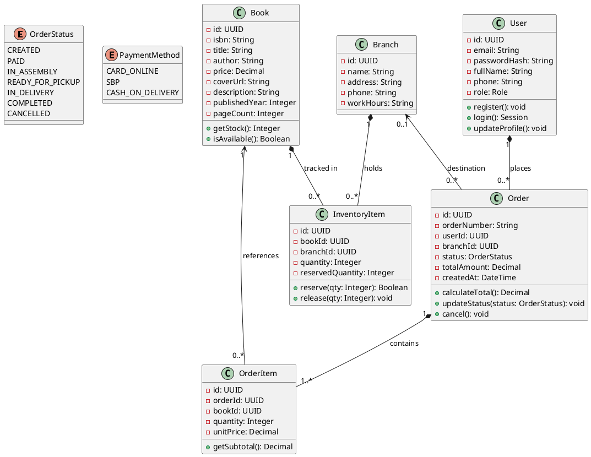
```plantuml
@startuml
enum OrderStatus {
  CREATED
  PAID
  IN_ASSEMBLY
  READY_FOR_PICKUP
  IN_DELIVERY
  COMPLETED
  CANCELLED
}

enum PaymentMethod {
  CARD_ONLINE
  SBP
  CASH_ON_DELIVERY
}

class User {
  - id: UUID
  - email: String
  - passwordHash: String
  - fullName: String
  - phone: String
  - role: Role
  + register(): void
  + login(): Session
  + updateProfile(): void
}

class Book {
  - id: UUID
  - isbn: String
  - title: String
  - author: String
  - price: Decimal
  - coverUrl: String
  - description: String
  - publishedYear: Integer
  - pageCount: Integer
  + getStock(): Integer
  + isAvailable(): Boolean
}

class InventoryItem {
  - id: UUID
  - bookId: UUID
  - branchId: UUID
  - quantity: Integer
  - reservedQuantity: Integer
  + reserve(qty: Integer): Boolean
  + release(qty: Integer): void
}

class Order {
  - id: UUID
  - orderNumber: String
  - userId: UUID
  - branchId: UUID
  - status: OrderStatus
  - totalAmount: Decimal
  - createdAt: DateTime
  + calculateTotal(): Decimal
  + updateStatus(status: OrderStatus): void
  + cancel(): void
}

class OrderItem {
  - id: UUID
  - orderId: UUID
  - bookId: UUID
  - quantity: Integer
  - unitPrice: Decimal
  + getSubtotal(): Decimal
}

class Branch {
  - id: UUID
  - name: String
  - address: String
  - phone: String
  - workHours: String
}

User "1" *-- "0..*" Order : places
Order "1" *-- "1..*" OrderItem : contains
Book "1" <-- "0..*" OrderItem : references
Book "1" *-- "0..*" InventoryItem : tracked in
Branch "1" *-- "0..*" InventoryItem : holds
Branch "0..1" <-- "0..*" Order : destination
@enduml
```
</details>

---

#### Доменная модель на языке Mermaid
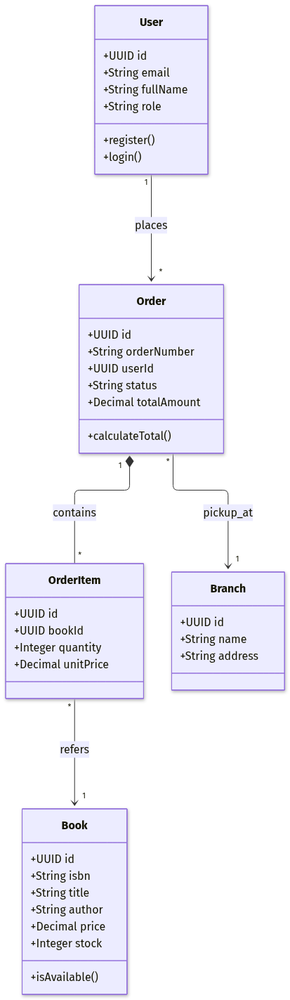

<details>
<summary>Показать исходный код Mermaid (Class Diagram)</summary>

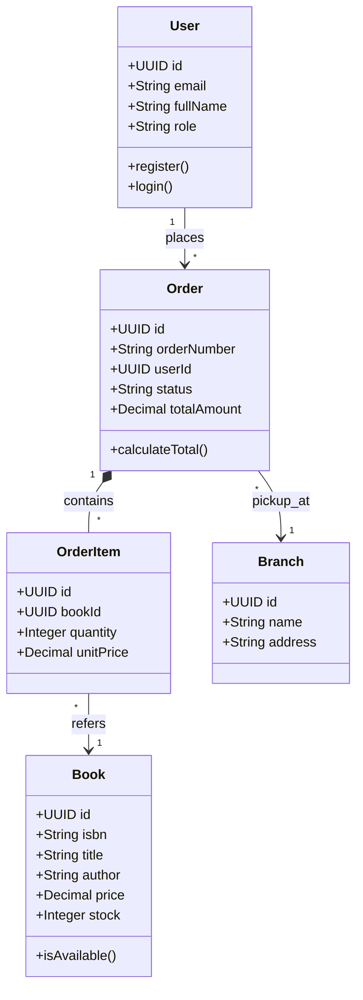
```mermaid
classDiagram
    class User {
        +UUID id
        +String email
        +String fullName
        +String role
        +register()
        +login()
    }

    class Book {
        +UUID id
        +String isbn
        +String title
        +String author
        +Decimal price
        +Integer stock
        +isAvailable()
    }

    class Order {
        +UUID id
        +String orderNumber
        +UUID userId
        +String status
        +Decimal totalAmount
        +calculateTotal()
    }

    class OrderItem {
        +UUID id
        +UUID bookId
        +Integer quantity
        +Decimal unitPrice
    }

    class Branch {
        +UUID id
        +String name
        +String address
    }

    User "1" --> "*" Order : places
    Order "1" *-- "*" OrderItem : contains
    OrderItem "*" --> "1" Book : refers
    Order "*" --> "1" Branch : pickup_at
```
</details>

---

## 4. Задание 4. Применение ИИ-агентов и расширенная спецификация UML

### 4.1. Разработка системных промптов (AI Skills for System Analyst)

Для автоматизации работы системного аналитика были составлены и протестированы специализированные промпты по методике SARD:

1. **Промпт для генерации пользовательских историй и критериев BDD:**
   ```markdown
   Роль: Senior Business Analyst в eCommerce.
   Контекст: Проект книжного онлайн-магазина Litera с Web и Mobile клиентами.
   Задача: Для бизнес-функции [НАЗВАНИЕ ФУНКЦИИ] составить User Story по шаблону "Как [роль], я хочу [действие], чтобы [ценность]".
   Требования:
   - Составить не менее 4-5 критериев приемки в строгом формате Given-When-Then (Gherkin).
   - Выделить платформенные различия для Web (доступность WCAG, шорткаты) и Mobile (жесты, офлайн, сенсоры).
   - Присвоить приоритет по шкале MoSCoW с кратким обоснованием.
   ```

2. **Промпт для проектирования UML Sequence Diagrams:**
   ```markdown
   Роль: Solution Architect.
   Задача: Сгенерировать валидный исходный код PlantUML Sequence Diagram для сценария [НАЗВАНИЕ СЦЕНАРИЯ].
   Требования:
   - Использовать autonumber, четкие названия участников (Actor, Gateway, Service, DB, Broker, External).
   - Отразить как позитивный сценарий (Happy Path), так и ветвления ошибок через блоки alt/else.
   - Указать протоколы взаимодействия (REST JSON, gRPC, AMQP).
   - Код должен быть строго синтаксически корректен и готов к компиляции.
   ```

3. **Промпт для формирования технической спецификации API (OpenAPI/SRS):**
   ```markdown
   Роль: Lead System Analyst.
   Задача: Описать микросервисный контракт для модуля [ИМЯ МОДУЛЯ] в нотации SRS (Карл Вигерс).
   Требования:
   - Входные/выходные параметры, валидация DTO, коды ответов HTTP (200, 400, 401, 404, 409, 500).
   - Требования к идемпотентности запросов (X-Idempotency-Key для финансовых транзакций).
   ```

---

### 4.2. Диаграммы последовательности (Sequence Diagrams) — 5 сценариев

#### Сценарий 1: Аутентификация и выпуск JWT токенов
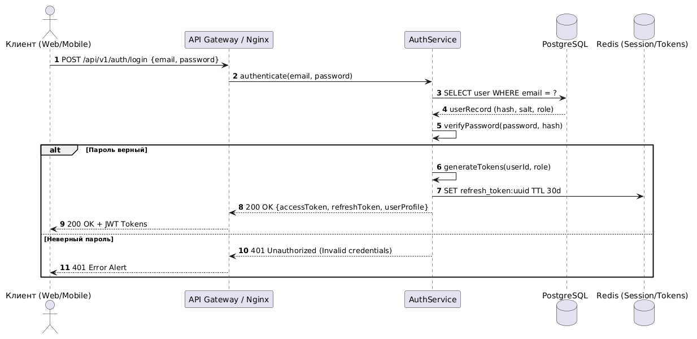

<details>
<summary>Исходный код PlantUML (Sequence Auth)</summary>

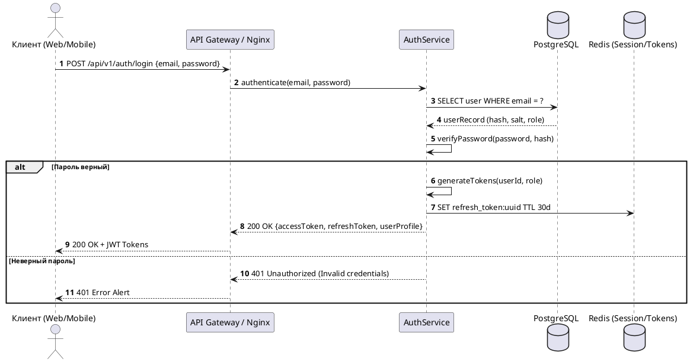
```plantuml
@startuml
autonumber
actor "Клиент (Web/Mobile)" as Client
participant "API Gateway / Nginx" as GW
participant "AuthService" as Auth
database "PostgreSQL" as DB
database "Redis (Session/Tokens)" as Cache

Client -> GW: POST /api/v1/auth/login {email, password}
GW -> Auth: authenticate(email, password)
Auth -> DB: SELECT user WHERE email = ?
DB --> Auth: userRecord (hash, salt, role)
Auth -> Auth: verifyPassword(password, hash)
alt Пароль верный
    Auth -> Auth: generateTokens(userId, role)
    Auth -> Cache: SET refresh_token:uuid TTL 30d
    Auth --> GW: 200 OK {accessToken, refreshToken, userProfile}
    GW --> Client: 200 OK + JWT Tokens
else Неверный пароль
    Auth --> GW: 401 Unauthorized (Invalid credentials)
    GW --> Client: 401 Error Alert
end
@enduml
```
</details>

---

#### Сценарий 2: Оформление заказа и онлайн-оплата
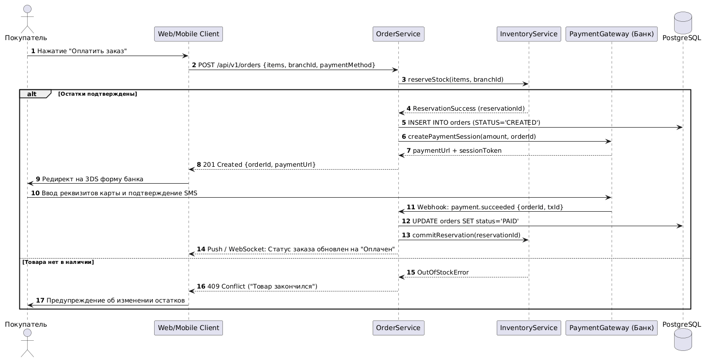

<details>
<summary>Исходный код PlantUML (Sequence Payment)</summary>

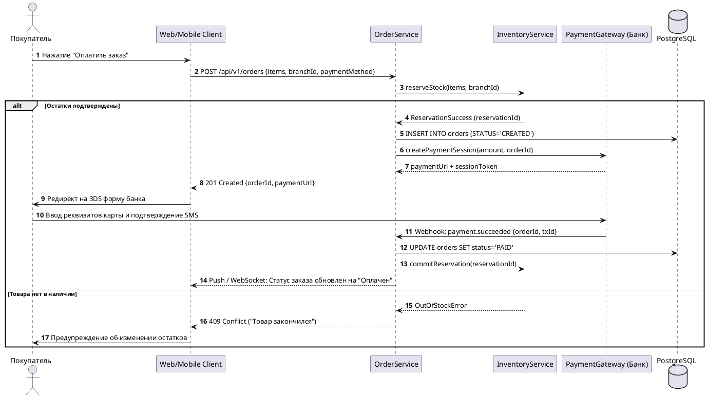
```plantuml
@startuml
autonumber
actor "Покупатель" as Buyer
participant "Web/Mobile Client" as App
participant "OrderService" as OrderSvc
participant "InventoryService" as InvSvc
participant "PaymentGateway (Банк)" as PayGW
database "PostgreSQL" as DB

Buyer -> App: Нажатие "Оплатить заказ"
App -> OrderSvc: POST /api/v1/orders {items, branchId, paymentMethod}
OrderSvc -> InvSvc: reserveStock(items, branchId)
alt Остатки подтверждены
    InvSvc --> OrderSvc: ReservationSuccess (reservationId)
    OrderSvc -> DB: INSERT INTO orders (STATUS='CREATED')
    OrderSvc -> PayGW: createPaymentSession(amount, orderId)
    PayGW --> OrderSvc: paymentUrl + sessionToken
    OrderSvc --> App: 201 Created {orderId, paymentUrl}
    App -> Buyer: Редирект на 3DS форму банка
    Buyer -> PayGW: Ввод реквизитов карты и подтверждение SMS
    PayGW -> OrderSvc: Webhook: payment.succeeded {orderId, txId}
    OrderSvc -> DB: UPDATE orders SET status='PAID'
    OrderSvc -> InvSvc: commitReservation(reservationId)
    OrderSvc --> App: Push / WebSocket: Статус заказа обновлен на "Оплачен"
else Товара нет в наличии
    InvSvc --> OrderSvc: OutOfStockError
    OrderSvc --> App: 409 Conflict ("Товар закончился")
    App -> Buyer: Предупреждение об изменении остатков
end
@enduml
```
</details>

---

#### Сценарий 3: Комплектация заказа на складе по штрихкоду
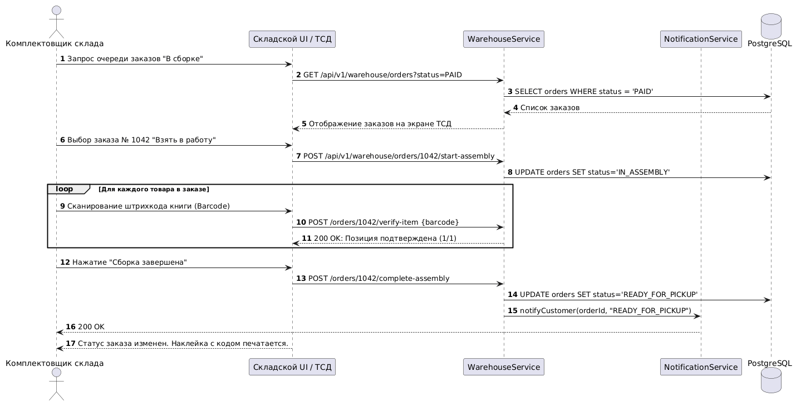

<details>
<summary>Исходный код PlantUML (Sequence Warehouse)</summary>

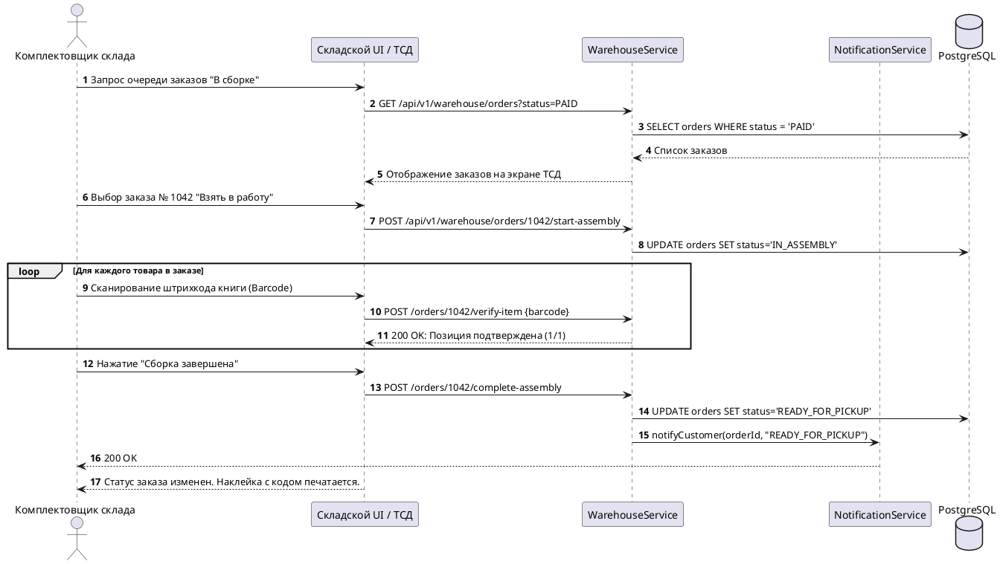
```plantuml
@startuml
autonumber
actor "Комплектовщик склада" as Worker
participant "Складской UI / ТСД" as TSD
participant "WarehouseService" as WHSvc
participant "NotificationService" as NotifSvc
database "PostgreSQL" as DB

Worker -> TSD: Запрос очереди заказов "В сборке"
TSD -> WHSvc: GET /api/v1/warehouse/orders?status=PAID
WHSvc -> DB: SELECT orders WHERE status = 'PAID'
DB --> WHSvc: Список заказов
WHSvc --> TSD: Отображение заказов на экране ТСД

Worker -> TSD: Выбор заказа № 1042 "Взять в работу"
TSD -> WHSvc: POST /api/v1/warehouse/orders/1042/start-assembly
WHSvc -> DB: UPDATE orders SET status='IN_ASSEMBLY'

loop Для каждого товара в заказе
    Worker -> TSD: Сканирование штрихкода книги (Barcode)
    TSD -> WHSvc: POST /orders/1042/verify-item {barcode}
    WHSvc --> TSD: 200 OK: Позиция подтверждена (1/1)
end

Worker -> TSD: Нажатие "Сборка завершена"
TSD -> WHSvc: POST /orders/1042/complete-assembly
WHSvc -> DB: UPDATE orders SET status='READY_FOR_PICKUP'
WHSvc -> NotifSvc: notifyCustomer(orderId, "READY_FOR_PICKUP")
NotifSvc --> Worker: 200 OK
TSD --> Worker: Статус заказа изменен. Наклейка с кодом печатается.
@enduml
```
</details>

---

#### Сценарий 4: Интеллектуальный поиск в каталоге с кэшированием
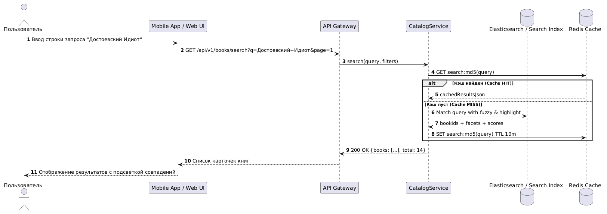

<details>
<summary>Исходный код PlantUML (Sequence Search)</summary>

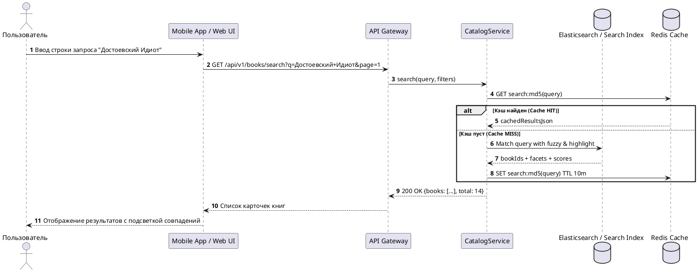
```plantuml
@startuml
autonumber
actor "Пользователь" as User
participant "Mobile App / Web UI" as UI
participant "API Gateway" as GW
participant "CatalogService" as CatSvc
database "Elasticsearch / Search Index" as SearchEngine
database "Redis Cache" as Cache

User -> UI: Ввод строки запроса "Достоевский Идиот"
UI -> GW: GET /api/v1/books/search?q=Достоевский+Идиот&page=1
GW -> CatSvc: search(query, filters)
CatSvc -> Cache: GET search:md5(query)
alt Кэш найден (Cache HIT)
    Cache --> CatSvc: cachedResultsJson
else Кэш пуст (Cache MISS)
    CatSvc -> SearchEngine: Match query with fuzzy & highlight
    SearchEngine --> CatSvc: bookIds + facets + scores
    CatSvc -> Cache: SET search:md5(query) TTL 10m
end
CatSvc --> GW: 200 OK {books: [...], total: 14}
GW --> UI: Список карточек книг
UI --> User: Отображение результатов с подсветкой совпадений
@enduml
```
</details>

---

#### Сценарий 5: Офлайн-корзина и синхронизация при переподключении
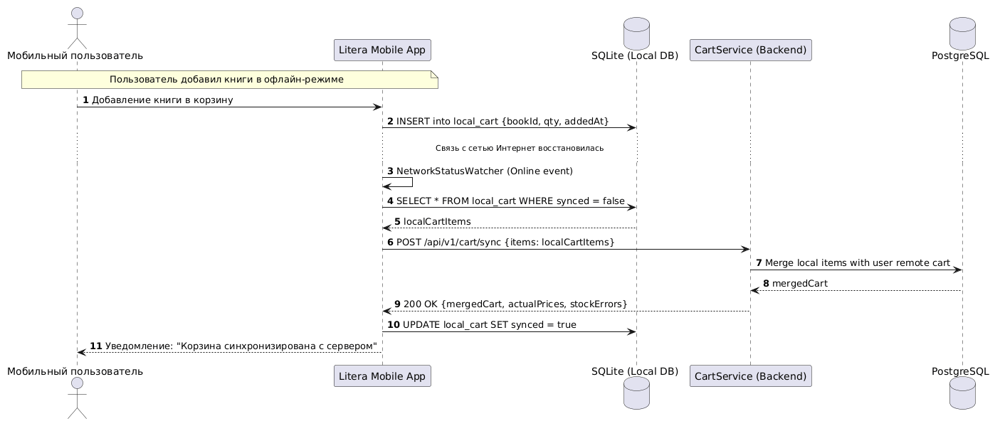

<details>
<summary>Исходный код PlantUML (Sequence Sync Cart)</summary>

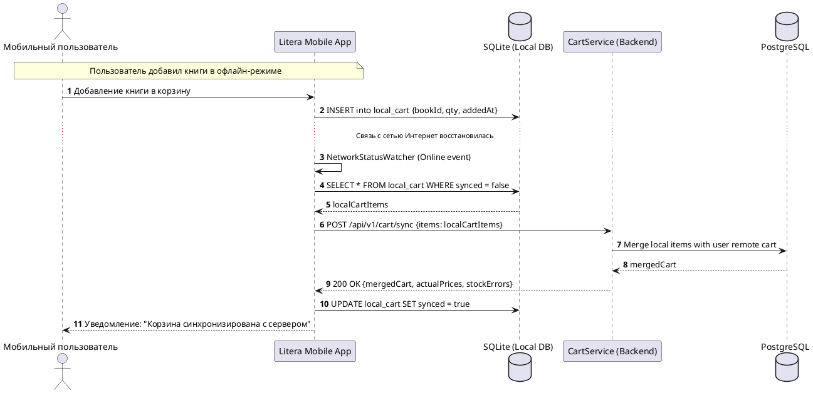
```plantuml
@startuml
autonumber
actor "Мобильный пользователь" as MUser
participant "Litera Mobile App" as App
database "SQLite (Local DB)" as LocalDB
participant "CartService (Backend)" as CartSvc
database "PostgreSQL" as RemoteDB

Note over MUser, App: Пользователь добавил книги в офлайн-режиме
MUser -> App: Добавление книги в корзину
App -> LocalDB: INSERT into local_cart {bookId, qty, addedAt}
... Связь с сетью Интернет восстановилась ...
App -> App: NetworkStatusWatcher (Online event)
App -> LocalDB: SELECT * FROM local_cart WHERE synced = false
LocalDB --> App: localCartItems
App -> CartSvc: POST /api/v1/cart/sync {items: localCartItems}
CartSvc -> RemoteDB: Merge local items with user remote cart
RemoteDB --> CartSvc: mergedCart
CartSvc --> App: 200 OK {mergedCart, actualPrices, stockErrors}
App -> LocalDB: UPDATE local_cart SET synced = true
App --> MUser: Уведомление: "Корзина синхронизирована с сервером"
@enduml
```
</details>

---

### 4.3. Дополнительные диаграммы классов архитектурных слоев (5 диаграмм)

#### 1. Сервисный слой и интерфейсы бизнес-логики
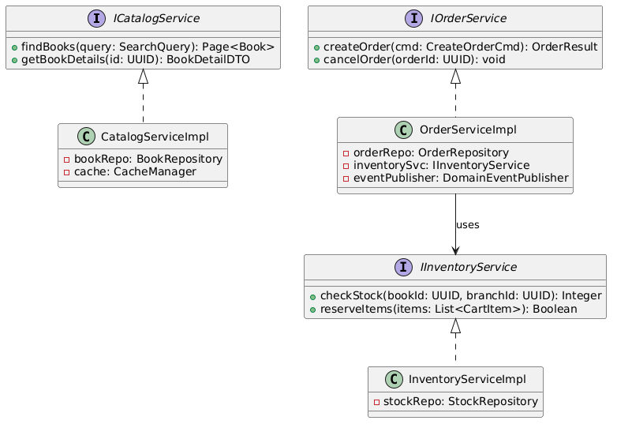

#### 2. Модели состояний представлений (UI State & ViewModels)
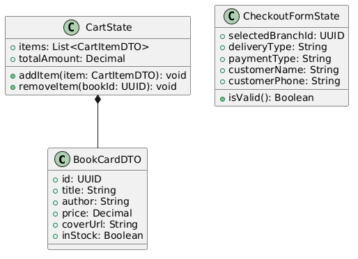

#### 3. Модель безопасности, токенов и прав доступа
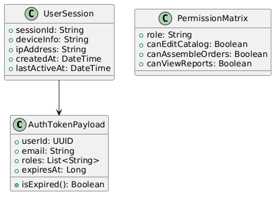

#### 4. Складская логистика и адресное хранение
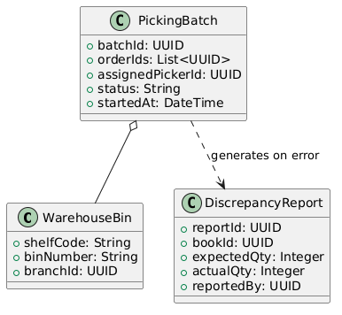

---

### 4.4. Структурные диаграммы компонентов, пакетов и развертывания

#### Диаграмма компонентов системы (Component Diagram)
Отражает распределение обязанностей между клиентскими приложениями, шлюзом, микросервисами бэкенда и брокером сообщений.
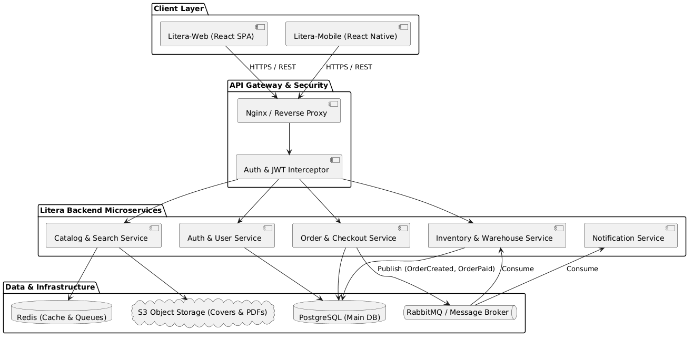

<details>
<summary>Исходный код PlantUML (Component Diagram)</summary>

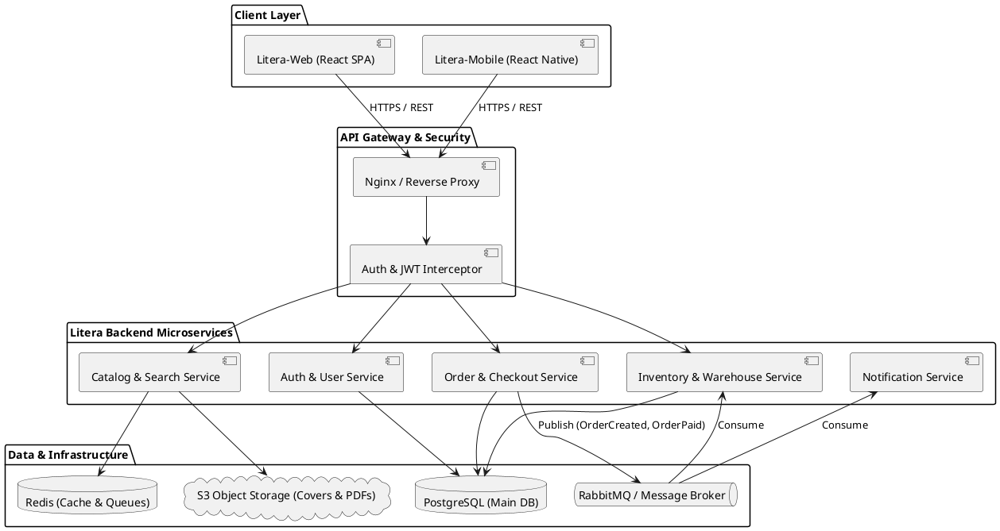
```plantuml
@startuml
package "Client Layer" {
  [Litera-Web (React SPA)] as WebApp
  [Litera-Mobile (React Native)] as MobileApp
}

package "API Gateway & Security" {
  [Nginx / Reverse Proxy] as Gateway
  [Auth & JWT Interceptor] as AuthFilter
}

package "Litera Backend Microservices" {
  [Auth & User Service] as UserService
  [Catalog & Search Service] as CatalogService
  [Order & Checkout Service] as OrderService
  [Inventory & Warehouse Service] as WarehouseService
  [Notification Service] as NotifService
}

package "Data & Infrastructure" {
  database "PostgreSQL (Main DB)" as PG
  database "Redis (Cache & Queues)" as Redis
  queue "RabbitMQ / Message Broker" as MQ
  cloud "S3 Object Storage (Covers & PDFs)" as S3
}

WebApp --> Gateway : HTTPS / REST
MobileApp --> Gateway : HTTPS / REST
Gateway --> AuthFilter
AuthFilter --> UserService
AuthFilter --> CatalogService
AuthFilter --> OrderService
AuthFilter --> WarehouseService

OrderService --> PG
UserService --> PG
WarehouseService --> PG
CatalogService --> Redis
CatalogService --> S3

OrderService --> MQ : Publish (OrderCreated, OrderPaid)
MQ --> WarehouseService : Consume
MQ --> NotifService : Consume
@enduml
```
</details>

---

#### Диаграмма пакетов (Package Diagram)
Демонстрирует организацию кодовой базы согласно принципам чистой архитектуры (Clean / Onion Architecture): UI $\rightarrow$ API $\rightarrow$ Domain $\rightarrow$ Infrastructure.
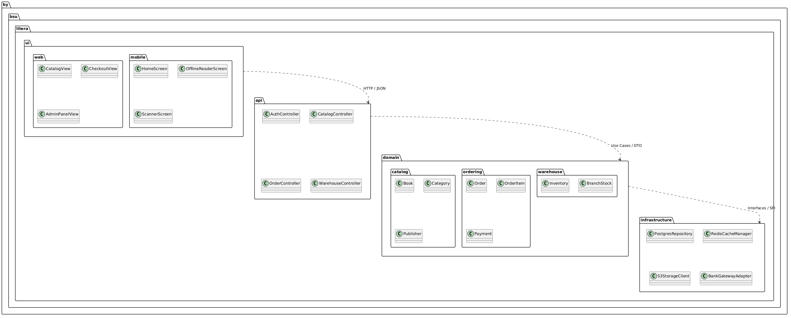

---

#### Диаграмма развертывания (Deployment Diagram)
Отражает физическое размещение сервисов на инфраструктуре (контейнеризация Docker, Nginx реверс-прокси, внешние облачные сервисы оплаты и хранения файлов).
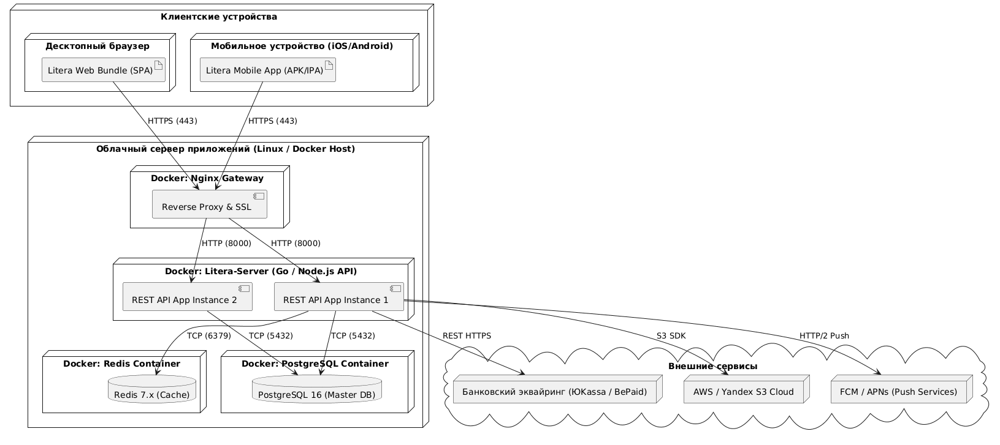

---

### 4.5. Схема базы данных (Entity-Relationship Diagram — ERD)
Реляционная структура данных PostgreSQL, отражающая учет товаров, филиалов, заказов и остатков.
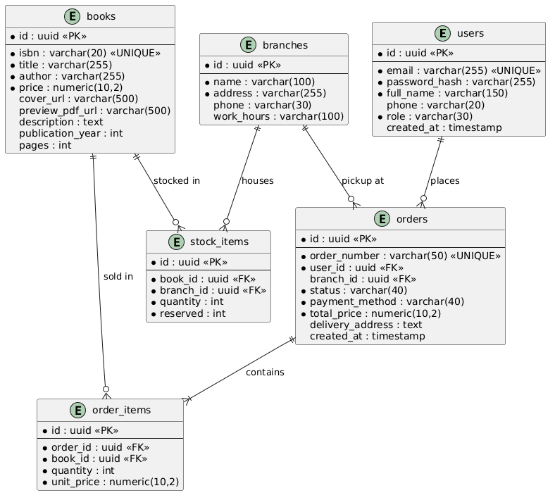

<details>
<summary>Исходный код PlantUML (ERD)</summary>

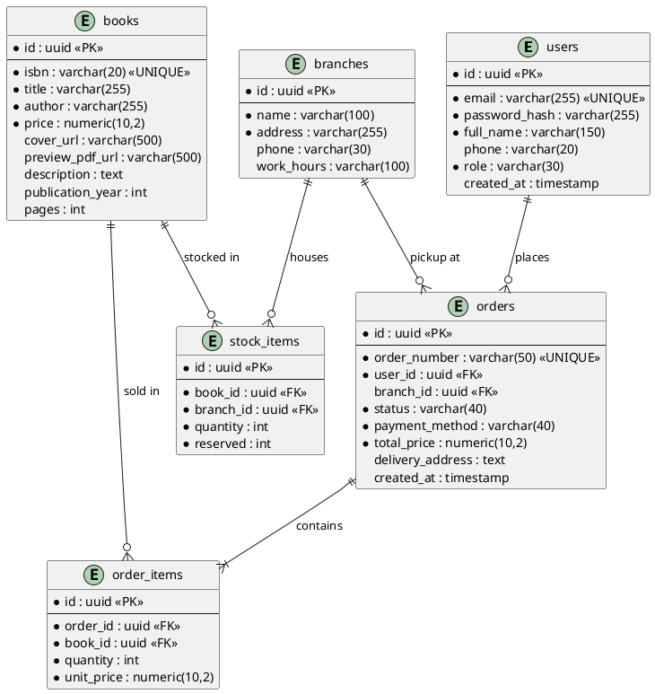
```plantuml
@startuml
entity "users" as users {
  * id : uuid <<PK>>
  --
  * email : varchar(255) <<UNIQUE>>
  * password_hash : varchar(255)
  * full_name : varchar(150)
  phone : varchar(20)
  * role : varchar(30)
  created_at : timestamp
}

entity "books" as books {
  * id : uuid <<PK>>
  --
  * isbn : varchar(20) <<UNIQUE>>
  * title : varchar(255)
  * author : varchar(255)
  * price : numeric(10,2)
  cover_url : varchar(500)
  preview_pdf_url : varchar(500)
  description : text
  publication_year : int
  pages : int
}

entity "branches" as branches {
  * id : uuid <<PK>>
  --
  * name : varchar(100)
  * address : varchar(255)
  phone : varchar(30)
  work_hours : varchar(100)
}

entity "stock_items" as stock_items {
  * id : uuid <<PK>>
  --
  * book_id : uuid <<FK>>
  * branch_id : uuid <<FK>>
  * quantity : int
  * reserved : int
}

entity "orders" as orders {
  * id : uuid <<PK>>
  --
  * order_number : varchar(50) <<UNIQUE>>
  * user_id : uuid <<FK>>
  branch_id : uuid <<FK>>
  * status : varchar(40)
  * payment_method : varchar(40)
  * total_price : numeric(10,2)
  delivery_address : text
  created_at : timestamp
}

entity "order_items" as order_items {
  * id : uuid <<PK>>
  --
  * order_id : uuid <<FK>>
  * book_id : uuid <<FK>>
  * quantity : int
  * unit_price : numeric(10,2)
}

users ||--o{ orders : "places"
orders ||--|{ order_items : "contains"
books ||--o{ order_items : "sold in"
books ||--o{ stock_items : "stocked in"
branches ||--o{ stock_items : "houses"
branches ||--o{ orders : "pickup at"
@enduml
```
</details>

---

## 5. Задание 5. Проектирование системы на основе метода EventStorming

Метод **EventStorming** применен для глубокого исследования предметной области, выявления событий предметной области (Domain Events), триггерных команд (Commands), бизнес-правил (Policies), агрегатов (Aggregates) и ограниченных контекстов (Bounded Contexts).

### 5.1. Уровни моделирования EventStorming
1. **Big Picture (Крупномасштабное исследование):** Выявлены основные сквозные этапы жизненного цикла взаимодействия клиента с книжным магазином: Поиск $\rightarrow$ Ознакомление $\rightarrow$ Формирование корзины $\rightarrow$ Финансовая транзакция $\rightarrow$ Складская комплектация $\rightarrow$ Вручение книги.
2. **Process Modeling (Моделирование процессов):** Определены автоматические реакции (политики). Например:
   * *Policy 1:* При возникновении события `OrderPlacedEvent` $\rightarrow$ сформировать платежную сессию во внешнем шлюзе.
   * *Policy 2:* При получении вебхука `PaymentCapturedEvent` $\rightarrow$ зарезервировать книги на балансе склада и перевести заказ в статус «В сборке».
3. **Software Design (Проектирование архитектурного решения):** Сгруппированы агрегаты `Cart`, `Order`, `WarehouseInventory` и очерчены границы Bounded Contexts.

#### Спецификация EventStorming
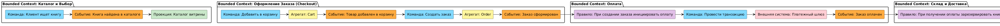

<details>
<summary>Исходный код PlantUML (EventStorming)</summary>


```plantuml
@startuml
skinparam defaultTextAlignment center

package "Bounded Context: Каталог и Выбор" {
  rectangle "Команда: Клиент ищет книгу" as C_Search #80D8FF
  rectangle "Событие: Книга найдена в каталоге" as E_Found #FFAB40
  rectangle "Проекция: Каталог витрины" as RM_Cat #C8E6C9
  C_Search -> E_Found
  E_Found -> RM_Cat
}

package "Bounded Context: Оформление Заказа (Checkout)" {
  rectangle "Команда: Добавить в корзину" as C_AddToCart #80D8FF
  rectangle "Агрегат: Cart" as A_Cart #FFF59D
  rectangle "Событие: Товар добавлен в корзину" as E_Added #FFAB40
  
  rectangle "Команда: Создать заказ" as C_CreateOrder #80D8FF
  rectangle "Агрегат: Order" as A_Order #FFF59D
  rectangle "Событие: Заказ сформирован" as E_Created #FFAB40
  
  C_AddToCart -> A_Cart
  A_Cart -> E_Added
  E_Added -> C_CreateOrder
  C_CreateOrder -> A_Order
  A_Order -> E_Created
}

package "Bounded Context: Оплата" {
  rectangle "Правило: При создании заказа инициировать оплату" as P_Pay #E1BEE7
  rectangle "Внешняя система: Платежный шлюз" as Ext_Pay #FFCDD2
  rectangle "Команда: Провести транзакцию" as C_Pay #80D8FF
  rectangle "Событие: Заказ оплачен" as E_Paid #FFAB40
  
  E_Created -> P_Pay
  P_Pay -> C_Pay
  C_Pay -> Ext_Pay
  Ext_Pay -> E_Paid
}

package "Bounded Context: Склад и Доставка" {
  rectangle "Правило: При получении оплаты зарезервировать книги" as P_Reserve #E1BEE7
  rectangle "Агрегат: WarehouseInventory" as A_Stock #FFF59D
  rectangle "Событие: Остатки зарезервированы" as E_Reserved #FFAB40
  rectangle "Команда: Собрать заказ" as C_Pack #80D8FF
  rectangle "Событие: Заказ готов к выдаче" as E_Ready #FFAB40
  
  E_Paid -> P_Reserve
  P_Reserve -> A_Stock
  A_Stock -> E_Reserved
  E_Reserved -> C_Pack
  C_Pack -> E_Ready
}
@enduml
```
</details>

---

## 6. Задание 6. Проектирование с применением метода Event Modeling

Метод **Event Modeling** (Адам Димитрук) структурирует систему на основе четырех паттернов изменения и чтения состояния во времени, идеально соответствующих парадигме CQRS / Event Sourcing:
1. **Command Pattern:** UI экран $\rightarrow$ Trigger $\rightarrow$ Command $\rightarrow$ Event(s).
2. **View Pattern:** Event(s) $\rightarrow$ Read Model (View) $\rightarrow$ Отображение в UI.
3. **Automation Pattern:** Event $\rightarrow$ Read Model $\rightarrow$ Automated Trigger $\rightarrow$ Command $\rightarrow$ Event.
4. **Translation Pattern:** Взаимодействие с внешними API (платежи, SMS-шлюзы) через адаптеры событий.

#### Спецификация Event Modeling
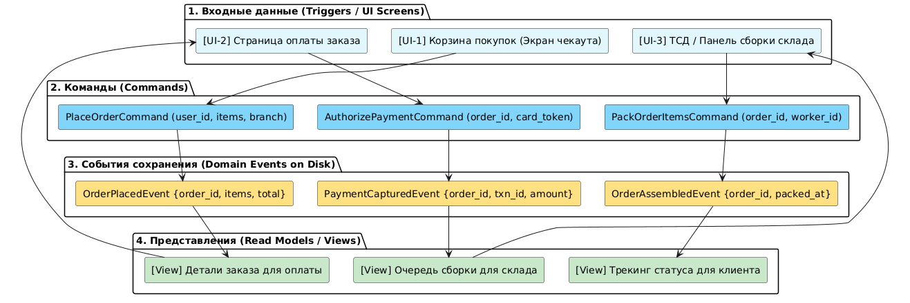

<details>
<summary>Исходный код PlantUML (Event Modeling)</summary>

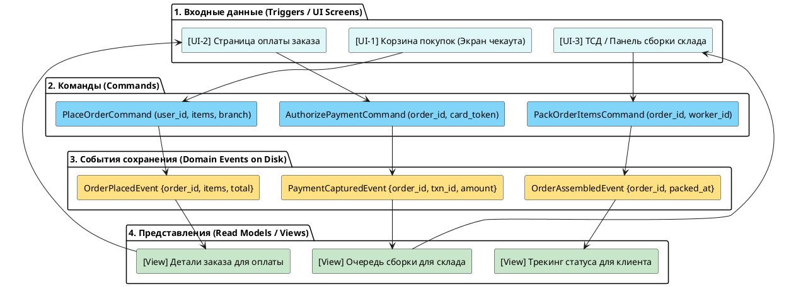
```plantuml
@startuml
skinparam defaultTextAlignment center

package "1. Входные данные (Triggers / UI Screens)" {
  rectangle "[UI-1] Корзина покупок (Экран чекаута)" as UI1 #E0F7FA
  rectangle "[UI-2] Страница оплаты заказа" as UI2 #E0F7FA
  rectangle "[UI-3] ТСД / Панель сборки склада" as UI3 #E0F7FA
}

package "2. Команды (Commands)" {
  rectangle "PlaceOrderCommand (user_id, items, branch)" as CMD1 #81D4FA
  rectangle "AuthorizePaymentCommand (order_id, card_token)" as CMD2 #81D4FA
  rectangle "PackOrderItemsCommand (order_id, worker_id)" as CMD3 #81D4FA
}

package "3. События сохранения (Domain Events on Disk)" {
  rectangle "OrderPlacedEvent {order_id, items, total}" as EVT1 #FFE082
  rectangle "PaymentCapturedEvent {order_id, txn_id, amount}" as EVT2 #FFE082
  rectangle "OrderAssembledEvent {order_id, packed_at}" as EVT3 #FFE082
}

package "4. Представления (Read Models / Views)" {
  rectangle "[View] Детали заказа для оплаты" as V1 #C8E6C9
  rectangle "[View] Очередь сборки для склада" as V2 #C8E6C9
  rectangle "[View] Трекинг статуса для клиента" as V3 #C8E6C9
}

UI1 -down-> CMD1
CMD1 -down-> EVT1
EVT1 -down-> V1
V1 -right-> UI2
UI2 -down-> CMD2
CMD2 -down-> EVT2
EVT2 -down-> V2
V2 -right-> UI3
UI3 -down-> CMD3
CMD3 -down-> EVT3
EVT3 -down-> V3
@enduml
```
</details>

---

## 7. Задание 7. Архитектура системы на основе C4 Model

Архитектурный фреймворк C4 (Саймон Браун) позволяет последовательно детализировать систему «Litera» от окружения верхнего уровня до отдельных сервисных модулей:

### 7.1. Уровень 1: Системный контекст (Context Diagram — C1)
Определяет людей и внешние сервисы, взаимодействующие с платформой Litera.
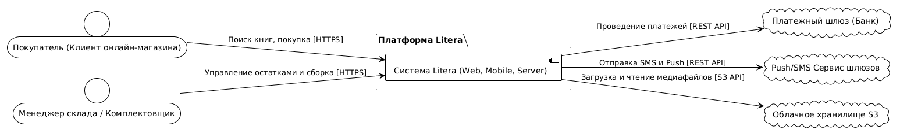

### 7.2. Уровень 2: Контейнеры (Container Diagram — C2)
Отражает архитектурные блоки исполнения: Single Page Application (React), мобильный клиент (React Native), API Gateway, бэкенд-сервер приложений и СУБД (PostgreSQL, Redis).
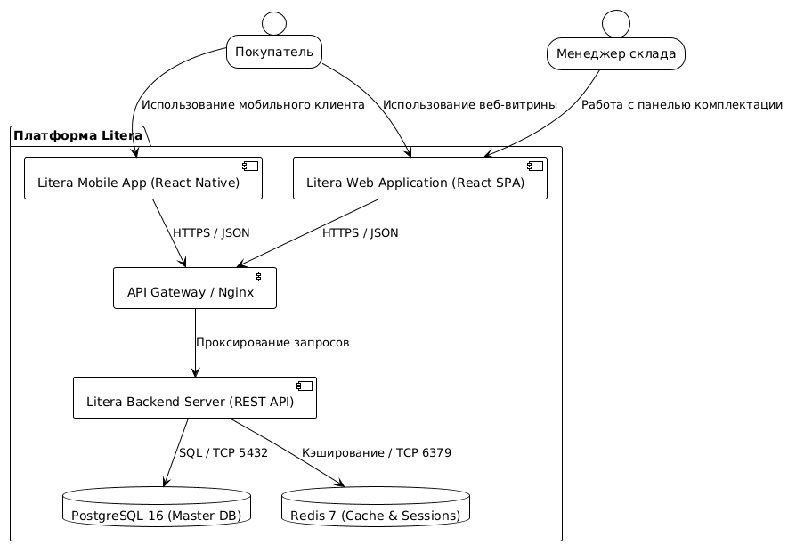

### 7.3. Уровень 3: Компоненты бэкенд-сервера (Component Diagram — C3)
Детализирует внутреннее устройство серверного контейнера: контроллеры безопасности, движок обработки заказов, модуль поиска и шину событий.
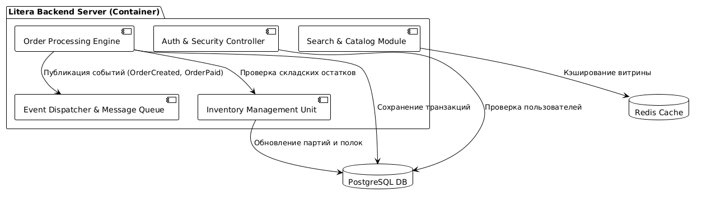

---

## 8. Задание 8. Техническое задание на разработку (SRS по Карлу Вигерсу)

### 1. Введение
* **1.1. Назначение:** Настоящий документ специфицирует функциональные и нефункциональные требования к кроссплатформенному программному обеспечению книжного онлайн-магазина «Litera».
* **1.2. Границы проекта:** Проект включает публичную витрину (Web), мобильное приложение покупателя (Mobile iOS/Android), бэкенд-сервер REST API и панель складской логистики.
* **1.3. Ссылки:** Методические указания к ЛР №3 (Минск, БГУ, 2026), IEEE Std 830-1998 (SRS), ISO/IEC 25010 (Software Quality).

### 2. Общее описание
* **2.1. Перспектива продукта:** «Litera» — импортонезависимое решение для автоматизации книжной розницы и электронной коммерции.
* **2.2. Классы пользователей:**
  * *Покупатели (B2C):* Массовая аудитория разного возраста. Требуется интуитивный UX, быстрый поиск и надежная оплата.
  * *Складской персонал (B2E):* Высокая скорость ввода, сканирование штрихкодов, защита от ошибок пересорта.
* **2.3. Операционная среда:**
  * Серверная часть: Linux Ubuntu Server LTS, среда Docker 26+, СУБД PostgreSQL 16.
  * Клиенты: Браузеры Chrome 120+, Safari 17+, Firefox 120+; Мобильные ОС Android 11+ и iOS 16+.

### 3. Функции системы
* **Ф-1 (Каталог и поиск):** Поддержка полнотекстового поиска с морфологией и опечатками; фасетная фильтрация по 12 параметрам.
* **Ф-2 (Интерактивный фрагмент):** Рендеринг ознакомительного фрагмента объемом до 30 страниц в веб-ридере без возможности сохранения исходного файла.
* **Ф-3 (Чекаут и платежи):** Интеграция с платежными шлюзами банков по протоколам СБП и банковских карт с поддержкой 3DS 2.0; автоматическое холдирование остатков на 15 минут.
* **Ф-4 (Складской учет):** Адресный учет ячеек хранения, поштучная комплектация по ISBN-сканеру, автоматическая отправка нотификаций при изменении статусов заказов.

### 4. Требования к внешним интерфейсам
* **4.1. Пользовательский интерфейс:** Соответствие WCAG 2.1 уровня AA, контрастность текста $\ge 4.5:1$, сенсорные области $\ge 48\times 48$ dp.
* **4.2. Программные интерфейсы:** RESTful API с форматом обмена JSON, версионирование `/api/v1/`, спецификация OpenAPI (Swagger) 3.0.
* **4.3. Аппаратные интерфейсы:** Использование камеры мобильного устройства для считывания одномерных штрихкодов EAN-13 / ISBN-13.

### 5. Атрибуты качества (Нефункциональные требования)
* **5.1. Производительность:** Время отклика API для 95% запросов витрины $< 200$ мс при нагрузке до 500 RPS.
* **5.2. Надежность и доступность:** Доступность сервиса (SLA) не менее 99.8% в режиме 24/7. Автоматический перезапуск контейнеров в Docker Swarm / K8s при сбоях.
* **5.3. Безопасность:**
  * Хранение паролей в виде криптостойких хэшей Argon2id / bcrypt.
  * Авторизация по протоколу JWT (Access token 15 мин, Refresh token 30 дней с ротацией).
  * Соответствие требованиям защиты персональных данных (Закон РБ № 99-З / 152-ФЗ).

---

## 9. Заключение

В рамках лабораторной работы №3 были выполнены все поставленные задачи:
1. Разработаны пользовательские истории (User Stories) с детализированными приемочными критериями Acceptance Criteria в формате BDD (Gherkin), отражающие специфику веб- и мобильного интерфейсов.
2. Построены и визуализированы спецификации поведенческих и структурных моделей с использованием PlantUML и Mermaid (Use Case, Activity, Class, Sequence, Component, Package, Deployment, ERD).
3. Продемонстрировано практическое применение современных техник концептуального проектирования: **EventStorming** и **Event Modeling**, позволивших детально формализовать реактивную архитектуру системы.
4. Выполнена структуризация архитектурного решения по методологии **C4 Model** на уровнях контекста, контейнеров и сервисных компонентов.
5. Разработано формализованное техническое задание (SRS) по стандарту Карла Вигерса.
